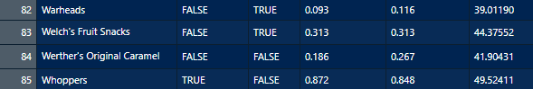

class: title-slide

```{r echo = FALSE, message=FALSE}
library(fivethirtyeight)
library(openintro)
library(tidyverse)
library(DiagrammeR)
library(DiagrammeRsvg)
library(rsvg)
library(magrittr)
library(dplyr)
library(fivethirtyeight)
library(titanic)
```

<br>
<br>
.right-panel[ 
<br>

# `r rmarkdown::metadata$title`

## `r rmarkdown::metadata$author`

]


---


## Data Science 

```{r echo = FALSE, message=FALSE}

data(bad_drivers)
candy_rankings <- candy_rankings %>% 
  select(competitorname, chocolate, fruity, sugarpercent, pricepercent, winpercent)
```

- Data-intensive studies have led to a new paradigm in scientific research. 

- Within this new paradigm, however, there are many new challenges involving analysis of big data due to large-scale scientific studies, routine use of digital sensors, and intensive computer simulations.

- To tackle these emerging challenges, the field of __data science__ brings together _statistics, computer science_, and _mathematics_ to solve data intensive problems.

- At its core, data science relies on statistical methods to solve scientific problems. These methods have their foundation in mathematics and are implemented using computational techniques. 


---

class: inverse center middle

.font100[Data Science in Scientific Studies]


---

## Some general terminologies

- To study a population, we measure a set of characteristics, which we refer to as __variables__.
- The objective of many scientific studies is to
learn about the __variation__ of a specific characteristic
(e.g., BMI, disease status) in the population of interest. 
- In many studies, we are interested in possible __relationships__ among different variables.
- We refer to the variables that are the main focus of our study as the
__response__ (or target) variables. 
- In contrast, we call variables that explain or predict the variation in the response variable as
__explanatory__ variables or __predictors__ depending on the role of these variables.
- Statistical analysis begins with a scientific problem usually presented
in the form of a __hypothesis testing__, __estimation__, or __prediction__
problem. 
 


---

## Alzheimer's Data

```{r echo=FALSE, out.width='90%', fig.align='center'}
knitr::include_graphics('img/data-matrix.png')
knitr::include_graphics('img/data-matrix-tail.png')
```


---

## Study design

If possible, before we conduct our study, we need to design it in order to (Cox and Donnelly, 2011)
  + avoid systematic error
  
  + reduce non-systematic error
  
  + ensure the scale of effort is appropriate; Goldilocks rule: not too limited, not too wasteful, just right!


---

## Common study designs

- Survey studies: Researchers collect information from individuals through some questions

- Observational studies: Researchers are passive examiners, trying to have the least impact on the data collection process.  

- Experiments: Researchers attempt to control the process as much as possible.


---

## Sampling design

- We cannot of course observe the whole population of interest or conduct experiments on them. 

- Instead, we select a __sample__ of representative members from the population.

- Then with the methods of __statistical inference__, the conclusions based on the sample can cautiously be attributed to the whole population.

---

## Sampling design

Some sampling schemes:

- Simple random sampling

- Stratified sampling

- Cluster sampling

- Multi-stage and temporal sampling


---


## Statistical inference

- We collect data on a sample from the population in order to learn about the whole population. 
- Note that in general the characteristics, relationships, and realities in the whole population always remain unknown. 
- Therefore, there is always some __uncertainty__ associated with our inference. 
- In Statistics, the mathematical tool to address uncertainty is __probability__. 
- The process of using the data to draw conclusions about the whole population, while acknowledging the extent of our uncertainty about our findings, is called __statistical inference__. 
- The knowledge we acquire from data through statistical inference allows us to make decisions with respect to the scientific problem that
motivated our study and our data analysis. 


---

class: inverse center middle

.font100[functions for data frames]

---

```{r}
head(bad_drivers)
```

---


```{r}
tail(bad_drivers)
```

---


```{r}
glimpse(bad_drivers)
```

---

```{r}
ncol(bad_drivers)
```

---

```{r}
nrow(bad_drivers)
```


---

class: middle 

## Data Frame for You to Try Out `candy_rankings`

```{r echo=FALSE, out.width='100%'}
knitr::include_graphics('img/data-candy.png')

```


---

class: middle

## In Break Out Rooms

- Download the code provided to you on the cluster website. 
- Put this document in the appropriate location of your `cosmos-dshs` folder.
- Knit the document.
- Follow the instructions for Activity 1.
- Keep this file open until the end of the session. We will get back to it.

---

class: center middle

## Bob Ross

<iframe width="560" height="315" src="https://www.youtube.com/embed/zIbR5TAz2xQ" frameborder="0" allow="accelerometer; autoplay; encrypted-media; gyroscope; picture-in-picture" allowfullscreen></iframe>


---

```{r}
glimpse(bob_ross)
```

---

class: center middle 


##`candy_rankings` vs `bob_ross`

False = 0  
True = 1


---

class: inverse middle center

.font100[Variable Types]

---


## Variables

```{r echo=FALSE, out.width='100%'}
knitr::include_graphics('img/data-candy.png')

```

---


```{r echo = FALSE, fig.align='center'}
diagram_small <- grViz("
    digraph {
        # graph aesthetics
        graph [ranksep = 0.3]
        # node definitions with substituted label text
        1 [label = 'Variables']
        2 [label = 'Categorical']
        3 [label = 'Numeric']
        
        # edge definitions with the node IDs
        1 -> 2
        1 -> 3
    }
")
tmp <- capture.output(rsvg_png(charToRaw(export_svg(diagram_small)),'img/diagram_small.png'))
knitr::include_graphics("img/diagram_small.png") 
```

---

## Variables

Variables `n_kids` (number of kids), `height`, and `winpercent` are __numerical variables__. 

--

We can do certain analyses using these variables such as finding an average `winpercent` or the maximum or minimum `winpercent` meaningfully.

--

Not everything represented by numbers represents a numeric quantity. e.g. Student ID, cell phone number.

---

## Variables

Variables such as `chocolate`, `fruity`, and `class_year` (first-year, sophomore, junior, senior) are __categorical variables__. 

--

Categorical variables have __levels__. For instance `chocolate` and `fruity` both have two levels as `TRUE` and `FALSE` and `class_year` have four levels.

---

class: middle

```{r}
glimpse(candy_rankings)
```

---

```{r}
glimpse(mariokart)
```

---

class: middle

`character`: takes string values (e.g. a person's name, address)

--

`integer`: integer (single precision)  

--

`double`: floating decimal (double precision) 

--

`numeric`: integer or double  

--

`factor`: categorical variables with different levels  

--

`logical`: TRUE (1), FALSE (0)  

---
class: inverse middle

As a data scientist it is .font30[**your**] job to check the type(s) of data that you are working with. Do .font30[**not**]  assume you will work with clean data frames, with clean names, labels, and types.

---

class: middle

## In Break Out Rooms

- Open the activity file you have already downloaded.
- Follow the instructions for Activity 2.


