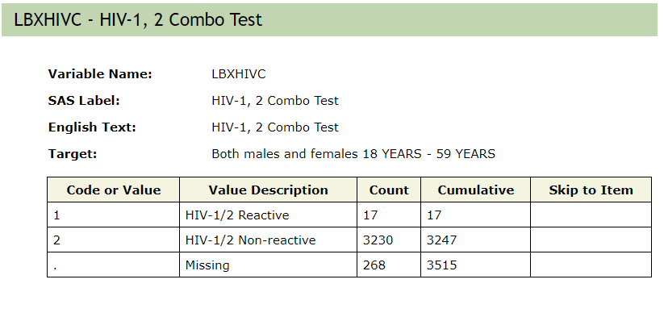

class: title-slide


```{r echo = FALSE, message = FALSE}
library(tidyverse)
options(scipen = 999)
```


<br>
<br>
.right-panel[ 

# `r rmarkdown::metadata$title`
## `r rmarkdown::metadata$author`
]


---

## Importing .csv Data 

`.csv` stands for comma separated values

```{r eval = FALSE}
readr::read_csv("dataset.csv")
```


---

## Importing Excel Data

```{r eval = FALSE}
readxl::read_excel("dataset.xlsx")
```


---
## Importing Excel Data

```{r eval = FALSE}
readxl::read_excel("dataset.xlsx", sheet = 2)
```

---

## Importing SAS, SPSS, Stata Data

```{r eval = FALSE}
library(haven)
# SAS
read_sas("dataset.sas7bdat")
# SPSS
read_sav("dataset.sav")
# Stata
read_dta("dataset.dta")
```

---

## Practice

- Open an `.Rmd` file.
- Download and import [anticancer peptides data set](https://archive.ics.uci.edu/ml/datasets/Anticancer+peptides) for breast cancer. 
- Download the [spotify data](https://cosmos-uci-dshs.github.io/dshs-slides/week01/data/spotify.xlsx) file. 
- Import the artist, album, and song data.


---

class: middle

## Practice

Download the HIV Antibody Test from the [CDC website](https://wwwn.cdc.gov/nchs/nhanes/search/datapage.aspx?Component=Laboratory&CycleBeginYear=2017). Import it into R. 
Note that this file has an `.XPT` extension which we have not seen before. 
Let's see if we can open it using one of the packages we have already seen. 

---

class: middle

## Writing data files

```{r eval = FALSE}
write_csv(data_frame, "dataset.csv")
write_xls(data_frame, "dataset.xlsx")
```

Similar code pattern holds true for other data formats.


---


```{r echo=FALSE, out.width='100%'}

```

.footnote[[National Health and Nutrition Examination Survey by CDC](https://wwwn.cdc.gov/Nchs/Nhanes/2017-2018/HIV_J.htm)
]

---

## Practice 

1. Change the name of the variable LBXHIVC to `hiv_1_2_combo`

2. Recode level 1 as `"HIV-1/2 Reactive"` and level 2 as `"HIV-1/2 Non-reactive"`

3. Count these levels. 

4. Write the summary table with counts into a `.csv` file.


