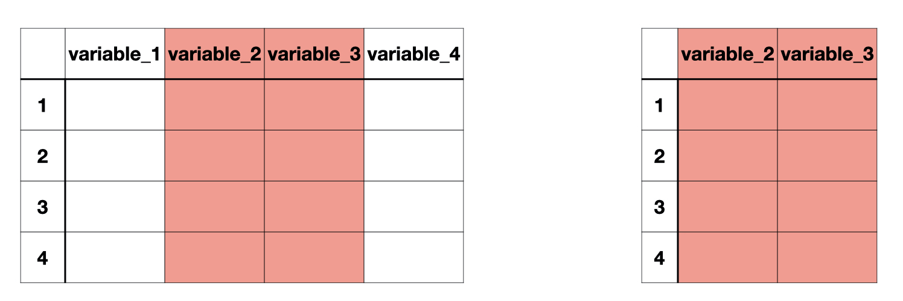
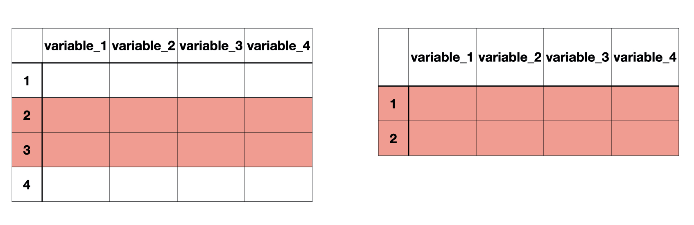

class: title-slide


```{r echo = FALSE, message = FALSE}
library(tidyverse)
options(scipen = 999)
```


<br>
<br>
.right-panel[ 

# `r rmarkdown::metadata$title`
## `r rmarkdown::metadata$author`
]

---

```{r echo = FALSE, message = FALSE}
library(tidyverse)

arthritis <- read_csv("https://raw.githubusercontent.com/cosmos-uci-dshs/data/main/RheumArth_Tx_AgeComparisons.csv") %>% 
  janitor::clean_names() %>% 
  mutate(sex = case_when(sex == 0 ~ "female",
                   sex == 1 ~ "male")) %>% 
  mutate(sex = as.factor(sex)) %>% 
  mutate(age_gp = case_when(age_gp == 1 ~ "control",
                   age_gp == 2 ~ "elderly")) %>% 
  mutate(age_gp = as.factor(age_gp)) %>% 
  mutate(cdai_yn = case_when(cdai_yn == 1 ~ "no",
                             cdai_yn == 2 ~ "yes")) %>%
  mutate(cdai_yn = as.factor(cdai_yn))
```


```{r}
glimpse(arthritis)
```

---

```{r}
colnames(arthritis)
```

---

## subsetting variables/columns

```{r echo = FALSE, out.width="80%"}

```

--

`select()`

---

## subsetting observations/rows

```{r echo = FALSE, out.width="80%"}

```

`slice()` and `filter()` 

---

`select` is used to select certain variables in the data frame. 


.left-panel[
```{r}
select(arthritis, age, cdai)
```
]

--

.right-panel[

```{r}
arthritis %>% 
  select(age, cdai)
```

]

---

`select` can also be used to drop certain variables if used with a negative sign.

```{r}
select(arthritis, -id, -sex)
```

---

## Selection helpers

`starts_with()`  
`ends_with()`  
`contains()`  

---

```{r}
select(arthritis, starts_with("cdai"))
```

---

```{r}
select(arthritis, contains("28"))
```

---

## subsetting variables/columns

```{r echo = FALSE, out.width="80%"}

```

--

`select()`

---

## subsetting observations/rows

```{r echo = FALSE, out.width="80%"}

```

`slice()` and `filter()` 

---

.pull-left[
`slice()` subsetting rows based on a row number.

The data below include all the rows from third to seventh. Including third and seventh.

```{r}
slice(arthritis, 3:7)
```


]

--

.pull-right[

`filter()` subsetting rows based on a condition.

The data below includes rows when the age is 90.

```{r}
filter(arthritis, age == 90)
```

]

---

.pull-left[

### Relational Operators in R


| Operator | Description              |
|----------|--------------------------|
| <        | Less than                |
| >        | Greater than             |
| <=       | Less than or equal to    |
| >=       | Greater than or equal to |
| ==       | Equal to                 |
| !=       | Not equal to             |

]

.pull-right[

### Logical Operators in R

| Operator | Description |
|----------|-------------|
| &        | and         |
| &#124;   | or          |

]


---


Recall that when CDAI > 22 it was identified as High Disease Activity in the data dictionary

```{r}
arthritis %>% 
  filter(age == 90 & cdai > 22)
```


---


```{r}
arthritis %>% 
  filter(age == 90 & cdai > 22) %>% 
  nrow()
```

Here is when piping helps. We can pipe into other functions such as `nrow()`

---


Q. How many patients are diagnosed with moderate disease activity (i.e. CDAI > 10 and ≤ 22)? 

--

```{r}
arthritis %>% 
  filter(cdai > 10 & cdai <= 22)
```

---

Q. How many patients are in remission (CDAI ≤ 2.8) and are female?


```{r}
arthritis %>% 
  filter(cdai <= 2.8 & sex == "female") %>% 
  nrow()
```

---

We have done all sorts of selections, slicing, filtering on `arthritis` but it has not changed at all. Why do you think so?

```{r}
glimpse(arthritis)
```

---

Moving forward we are only going to use, `age`, `age_gp` `sex`, `yrs_from_dx` and `cdai`. Let's clean our data accordingly and move on with the smaller `arthritis` data that we need.

---

```{r}
arthritis %>% 
  select(age, age_gp, 
         sex, yrs_from_dx,
         cdai)
```

---

```{r}
arthritis <- 
  arthritis %>% 
  select(age, age_gp, 
         sex, yrs_from_dx,
         cdai)
```


---

```{r}
glimpse(arthritis)
```

---

class: inverse

.font50[Grouping Data]

---

Recall this question from the lab: 

> Do "elderly" group have higher or lower CDAI overall when compared with the "control" group? Answer with a visual and comment on what you see.

--
.pull-left[


```{r warning = FALSE, echo=FALSE, fig.height=4}
ggplot(arthritis, 
       aes(x = age_gp, y = cdai)) +
  geom_boxplot() +
  theme_bw() +
  theme(text = element_text(size=20)) +
  labs(x = "Age Group", y = "CDAI")
```

]

.pull-right[
```{r warning = FALSE, eval=FALSE}
ggplot(arthritis, 
       aes(x = age_gp, y = cdai)) +
  geom_boxplot() +
  theme_bw() +
  theme(text = element_text(size=20)) +
  labs(x = "Age Group", y = "CDAI")
```

]

---

```{r echo = FALSE, out.width="80%", fig.align='center'}
knitr::include_graphics("img/data-wrangle.003.jpeg")
```
Here `variable_2` represents a factor. We can **group** the rest of the data **by** this factor variable. 


---

Once we group the data, we won't see much difference other than `Groups:   age_gp [2]` statement, everything else will be similar. 

```{r}
arthritis %>% 
  group_by(age_gp) 
```


---

```{r}
arthritis %>% 
  group_by(age_gp) %>% 
  summarize(median(cdai, na.rm = TRUE))
```

---

We can also calculate other descriptives as well as number of observations for each group.

```{r}
arthritis %>% 
  group_by(age_gp) %>% 
  summarize(med_cdai = median(cdai, na.rm = TRUE),
            mean_cdai = mean(cdai, na.rm = TRUE),
            n_cdai = n())
```


