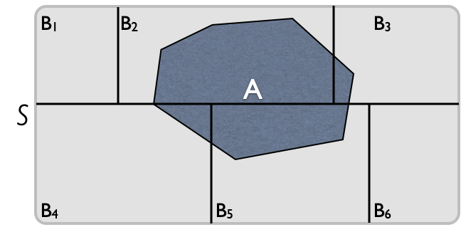
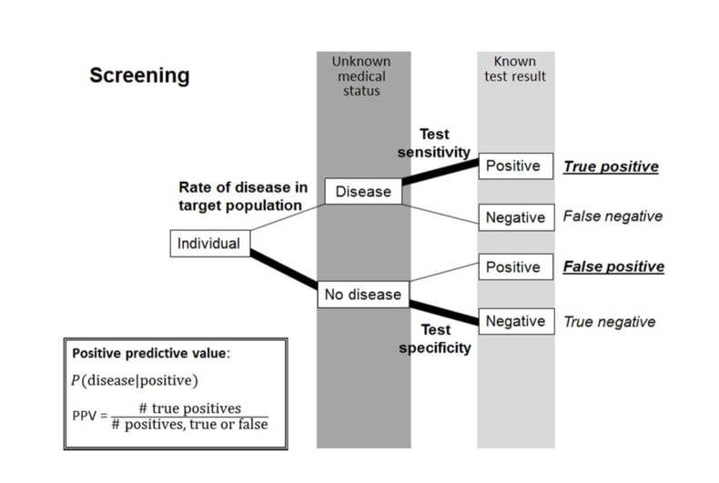
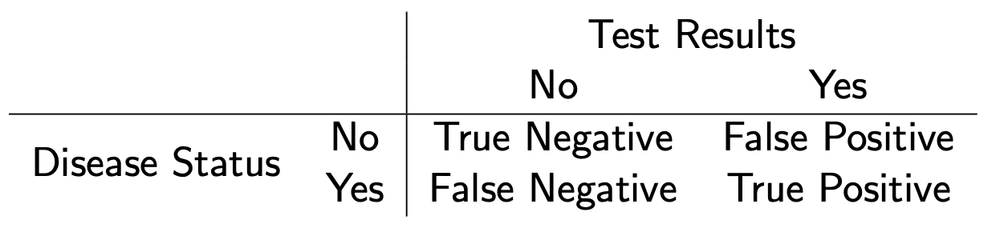
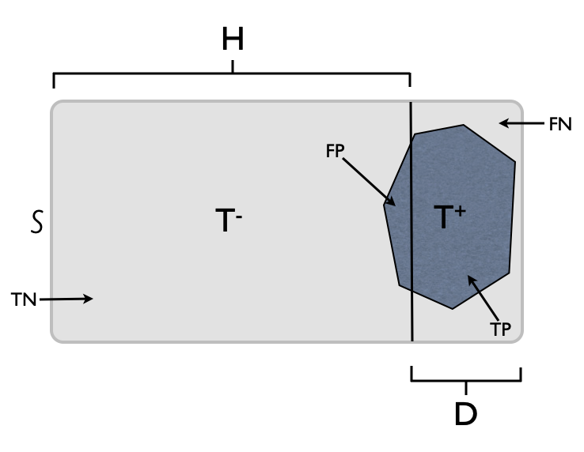

class: title-slide

```{r echo = FALSE}
library(fabricerin)
```

<br>
<br>
.right-panel[ 
<br>

# `r rmarkdown::metadata$title`

### `r rmarkdown::metadata$author`

]

---

class: middle

### Introduction
 - We have used plots and summary statistics to learn about the distribution of different variables in the observed data and to investigate their relationships. 
 
 - We now want to **generalize** our findings to the entire population of interest. 
 
 - However, we almost always remain uncertain about the true distributions and relationships in the population.
 
 - Therefore, when we generalize our findings from a sample to the whole population, we should explicitly specify the extent of our uncertainty.  
 
 - We use probability as a measure of our uncertainty.
 
 
---
 
### Some Commonly Used Genetic Terms

- Throughout this lecture, we will use the following concepts from genetics:  

  - Gene

  - Single Nucleotide Polymorphisms (SNPs)

  - Alleles

  - Genotype

  - Homozygous vs. heterozygous

  - Phenotype

  - Recessive vs. dominant

---

### Random phenomena and their sample space

- A phenomenon is called random if its outcome (value) cannot be determined with certainty before it occurs. 

- For example, coin tossing and genotypes  are random phenomena.

- The collection of all possible outcomes $S$ is called the sample space. 
$$\begin{array}{l@{\quad}l}
\text{Coin tossing:}  & S=\{H, T\}, \\
\text{Die rolling:} &  S=\{1, 2, 3, 4, 5, 6\}, \\
\text{Bi-allelic gene:} & S=\{A,a\},\\
\text{Genotype:} & S=\{\mathit{AA}, \mathit{Aa}, \mathit{aa}\}.
\end{array}$$
---

### Probability

- To each possible outcome in the sample space, we assign a probability $P$, which represents how certain we are about the occurrence of the corresponding outcome. 

- For an outcome $o$, we denote the probability as $P(o)$, where $0 \le P(o) \le 1$. 

- The total probability of all outcomes in the sample space is always 1.

  - Coin tossing: $P(H)+ P(T)=1$
  - Die rolling:  $P(1)+P(2)+P(3)+P(4)+P(5)+P(6) = 1$.

- Therefore, if the outcomes are equally probable, the probability of
each outcome is $1/n_{S}$, where $n_{S}$ is the number of possible
outcomes.
  
---

### Random events

- An **event** is a subset of the sample space $S$. 

- A possible event for die rolling is $E = \{1, 3, 5\}$. This is the event of rolling an
odd number. 

- For the genotype example, $E=\{\mathit{AA}, \mathit{aa}\}$
is the event that a person is homozygous.

- An event occurs when any outcome within that event occurs. 

- We denote the probability of event $E$ as $P(E)$.
 
- The probability of an event is the sum of the probabilities for all
individual outcomes included in that event.

---

### Example

- As a running example, we consider a bi-allelic gene A with
two alleles $A$ and $a$. 

- We assume that allele $a$ is recessive and
causes a specific disease. 

- Then only people with the genotype
$\mathit{aa}$ have the disease. 

```{r, echo=FALSE,out.width='50%',fig.align='center'}
knitr::include_graphics('img/vennGene1.png')
```

---

### Example
- We can define four events as follows:
$$\begin{array}{l@{\quad}l}
\text{The homozygous event:} & HM = \{\mathit{AA}, \mathit{aa}\}, \\
\text{The heterozygous event:} & HT  = \{\mathit{Aa}\},  \\  
\text{The no-disease event:} & ND   = \{\mathit{AA}, \mathit{Aa}\}, \\
\text{The disease event:} & D   = \{\mathit{aa}\} .
\end{array}$$
- Assume $P(\mathit{AA}) = 0.49$,
$P(\mathit{Aa}) = 0.42$, and $P(\mathit{aa}) = 0.09$. Then,
$$
\begin{eqnarray*}
P(HM ) & = & 0.49+0.09 = 0.58,  \\
P(HT ) & = & 0.42, \\
P(ND) & = & 0.49 + 0.42 = 0.91,\\
P(D) & = & 0.09.
\end{eqnarray*}
$$
---

### Complement
- For any event $E$, we define its **complement**, $E^c$, as the set
of all outcomes that are in the sample space $S$ but not in $E$.

- For the gene-disease example, the complement of the homozygous event
$HM  = \{\mathit{AA}, \mathit{aa}\}$ is the heterozygous event
$\{\mathit{Aa}\}$; we show this as $HM^{c} = HT$. 

- Likewise, the complement of the disease event, $D=\{\mathit{aa}\}$, is the no-disease
event, $ND = \{\mathit{AA}, \mathit{Aa}\}$; we show this as $D^{c} = ND$.

- The probability of the complement event is 1 minus the probability of
the event:
$$P\bigl(E^{c}\bigr) = 1- P(E).$$


---

### Union

- For two events $E_{1}$ and $E_{2}$ in a sample space $S$, we define
their **union** $E_{1}\cup E_{2}$ as the set of all outcomes that
are at least in one of the events. 

- The union $E_{1}\cup E_{2}$ is an
event by itself, and it occurs when **either** $E_{1}$ **or**
$E_{2}$ (or both) occurs. 

- For example, the
union of the heterozygous event, $HT$, and the disease event, $D$, is
$\{\mathit{Aa}\} \cup \{\mathit{aa}\} = \{\mathit{Aa}, \mathit{aa}\}$.

- When possible, we can identify the outcomes in the
union of the two events and find the probability by adding the
probabilities of those outcomes.

---


### Intersection

- For two events $E_{1}$ and $E_{2}$ in a sample space $S$, we define their **intersection** $E_{1} \cap E_{2}$ as the set of outcomes that are in **both** events. 

- The intersection $E_{1}\cap E_{2}$ is an event
by itself, and it occurs when both $E_{1}$ **and** $E_{2}$ occur.

- The intersection of
the homozygous event and the no-disease event is $HM  \cap ND = \{\mathit{AA}\}$.

- When possible, we can identify the outcomes in the
intersection of the two events and find the probability by adding the
probabilities of those outcomes.

---

### Joint vs. marginal probability
- We refer to the probability of the intersection of two events, $P(E_{1} \cap E_{2})$, as their **joint probability**. 

- In contrast, we refer to probabilities $P(E_{1})$ and $P(E_{2})$ as the **marginal probabilities** of events $E_{1}$ and $E_{2}$.

- For any two events $E_{1}$ and $E_{2}$, we have

$$P(E_{1} \cup E_{2}) = P(E_{1}) + P(E_{2}) - P(E_{1} \cap E_{2}).$$
- That is, the probability of the union $P(E_1 \cup E_2)$ is the sum of their marginal probabilities minus their joint probability. 

---

### Joint vs. marginal probability

- For example, the union of the heterozygous and the no-disease events is
$$\begin{eqnarray*}
P(HM  \cup ND)  &=&  P(HM ) + P(ND) - P(HM  \cap ND) \\
  &= & 0.58 + 0.91 - 0.49 = 1.
\end{eqnarray*}$$

---

### Disjoint events
- Two events are called **disjoint** or **mutually exclusive** if they never occur together: if we know that one of them has occurred, we can conclude that the other event has not occurred. 

- Disjoint events have no
elements (outcomes) in common, and their intersection is the empty set.

- For the above example, if a person is heterozygous, we know that he does not have the disease so the two events $HT$ and $ND$ are disjoint. 


---

### Disjoint events

- For two disjoint events $E_{1}$ and $E_{2}$, the probability of their
intersection (i.e., their joint probability) is zero: 
$$P(E_{1} \cap E_{2}) = P(\phi) =  0$$
- Therefore, the probability of the union of the two disjoint events is simply the sum of their marginal probabilities: 
$$P(E_{1} \cup E_{2}) = P(E_{1}) + P(E_{2})$$
- In general, if we have multiple disjoint events, $E_1$, $E_2$, ..., $E_n$, then the probability of their union is the sum of the marginal probabilities:
$$P(E_1 \cup E_2 \cup ... \cup E_n) = P(E_1) + P(E_2) + ... + P(E_n)$$

---

### Partition

- When two or more events are disjoint and their union is the sample
space $S$, we say that the events form a **partition** of the
sample space.

- Two complementary events $E$ and $E^{c}$ always form a partition of the
sample space since they are disjoint and their union is the sample
space.

---

### Conditional probability

- Ver often, we need to discuss possible changes in the
probability of one event based on our knowledge regarding the
occurrence of another event.

- The **conditional probability**, denoted  $P(E_{1}|E_{2})$, is the
probability of event $E_1$ given that another event $E_2$ has occurred.

- The conditional probability of event $E_1$ given event $E_2$ can be
calculated as follows: (assuming $P(E_{2}) \ne 0$)

$$P(E_{1}|E_{2}) = \frac{P(E_{1} \cap E_{2})}{P(E_{2})}.$$

- This is the joint probability of the two events divided
by the marginal probability of the event on which we are conditioning.


---

### The law of total probability

- By rearranging the equation for conditional probabilities, we have
$$P(E_{1} \cap E_{2}) = P(E_{1}|E_{2})P(E_{2}).$$

- Now suppose that a set of $K$ events $B_1, B_2, \ldots, B_K$ forms a
partition of the sample space.
```{r, echo=FALSE,out.width='50%',fig.align='center'}

```

---

### The law of total probability

- Using the above equation, we have
$$P(A)  =  P(A|B_{1})P(B_{1}) + \cdots + P(A|B_{K})P(B_{K}).$$
- This is known as the **law of total probability**.


---

### Independent events

- Two events $E_{1}$ and $E_{2}$ are **independent** if our
knowledge of the occurrence of one event does not change the
probability of occurrence of the other event. 

\begin{eqnarray*}
P(E_{1}|E_{2}) & = & P(E_{1}), \\
P(E_{2}|E_{1}) & = & P(E_{2}).
\end{eqnarray*}

- For example, if a disease is not genetic, knowing a person has a specific genotype (e.g., $AA$) does not  change the probability of having that disease. 

---

### Independent events

- When two events $E_{1}$ and $E_{2}$ are independent, the probability
that $E_{1}$ and $E_{2}$ occur simultaneously, i.e., their joint
probability, is the product of their marginal probabilities:

$$P(E_{1} \cap E_{2}) = P(E_{1})\times P(E_{2})$$

- Therefore, the probability of the union of two independent events is as follows:
$$P(E_{1} \cup E_{2}) = P(E_{1}) + P(E_{2}) - P(E_{1}) \times P(E_{2}).$$


---

### Bayes' theorem

- Sometimes, we know the conditional
probability of $E_{1}$ given $E_{2}$, but we are interested in the
conditional probability of $E_{2}$ given $E_{1}$. 

- For example, suppose
that the probability of having lung cancer is $P(C) = 0.001$ and that
the probability of being a smoker is $P(SM) = 0.25$. 

- Further, suppose
we know that if a person has lung cancer, the probability of being a
smoker increases to $P(SM |C) = 0.40$.  

- We are, however, interested in
the probability of developing lung cancer if a person is a smoker,
$P(C|SM)$. 


---

### Bayes' theorem

- In general, for two events $E_1$ and $E_2$, the following equation
shows the relationship between $P(E_{2}|E_{1})$ and $P(E_{1}|E_{2})$:
$$P(E_{2}|E_{1})  =  \frac{P(E_{1}|E_{2})P(E_{2})}{P(E_{1})}.$$

- This formula is known as **Bayes' theorem** or **Bayes' rule**.

---

### Bayes' theorem

- For the above example, 
$$P(C|SM)  =  \frac{P(SM|C)P(C) }{P(SM)} = \frac{ 0.4 \times 0.001}{0.25} = 0.0016.$$

- Therefore, the probability of lung cancer for smokers increases from
0.001 to 0.0016. 


---

### A more  general form of Bayes' theorem

- Suppose a set of $K$ events $B_1, B_2, \ldots, B_K$ form a partition of the sample space. We can write the Bayes' theorem for each of the partitioning events as follows: 
$$\begin{eqnarray*}
P(B_{i}|A) & = & \frac{ P(A|B_{i})P(B_{i})  }{P(A)}
\end{eqnarray*}$$

- Here, $B_{i}$ is one of the partitioning events and $A$ is an event in the sample space. Using the law of total probability, we have
$$\begin{eqnarray*}
P(A) = \sum^{K}_{k=1}P(A|B_k)P(B_k)
\end{eqnarray*}$$

---

### A more  general form of Bayes' theorem

- Therefore, we can write the general form of Bayes' theorem as 
$$\begin{eqnarray}
P(B_{i}|A) & = & \frac{ P(A|B_{i})P(B_{i})  }{\sum^{K}_{k=1}P(A|B_k)P(B_k)}
\end{eqnarray}$$

- We will use this general form in analysis of diagnostic tests discussed below. 
---

### Diagnostic tests


- Diagnostic tests provide an interesting example of Bayes' theorem. 
- The following figure from Baldi and Utts (2015) summarizes a typical screening process: 
```{r, echo=FALSE,out.width='55%',fig.align='center'}

```

---

### Diagnostic tests

- We can summarize different scenarios as follows:

```{r, echo=FALSE,out.width='80%',fig.align='center'}

```

---

### Diagnostic tests

- Based on this table, we have

$$\begin{eqnarray*}
\textrm{Sensitivity} & = & P(\textrm{Positive} | \textrm{Disease} )\\
\textrm{Specificity} & = & P(\textrm{Negative} | \textrm{No Disease})\\
\textrm{Positive Predictive Value (PPV)} & = & P(\textrm{Disease} | \textrm{Positive})
\end{eqnarray*}$$
- Using the general form of Bayes' theorem, we have:
$$\begin{eqnarray*}
\textrm{PPV} & = & \frac{\textrm{sensitivity} \times \textrm{prevalence}  }{\textrm{sensitivity} \times \textrm{prevalence}  +  \textrm{(1- specificity)} \times \textrm{(1- prevalence)} }
\end{eqnarray*}$$
where *prevalence* is the overall probability of the disease in the population: $P(Disease)$ 

---

### Diagnostic tests

- The following plot is used to obtain the value of PPV. 

```{r, echo=FALSE,out.width='50%',fig.align='center'}

```

---

### Diagnostic tests

- In the above figure, the following abbreviations are used: $S$ for sample space, $H$ for healthy, $D$ for diseased, $T^-$ for negative test result, $T^+$ for positive test result. 

- The shaded area to the right of vertical line is the true positive $TP$, the shaded area to the left of the vertical line is the false negative $FN$, the unshaded area to the left of the vertical line is the true negative $TN$, and the unshaded area to the right of the vertical line is the false negative $FN$ for the test.

- Therefore, the general form of Bayes' theorm can be written as follows:

$$P(D|T^{+})  =  \frac{ P(T^{+}|D)P(D)}{P(T^{+}|D)P(D) + P(T^{+} | H)P(H)} $$