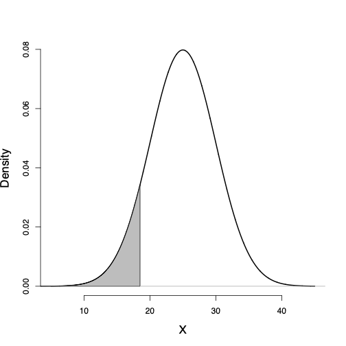

class: title-slide

```{r echo = FALSE}
library(fabricerin)
```

<br>
<br>
.right-panel[ 
<br>

# `r rmarkdown::metadata$title`

### `r rmarkdown::metadata$author`

]

---

### Random Variables

- In this lecture, we will discuss random variables and their probability distributions.

- Formally, a **random variable** $X$ assigns a
numerical value to each possible outcome (and event) of a random
phenomenon. 

- For instance, we can define $X$ for possible genotypes
of a bi-allelic gene **A** as follows:
$$X = \left\{ \begin{array}{l@{\quad}l}
0 &  \mbox{for genotype } \mathit{AA}, \\
1 &  \mbox{for genotype } \mathit{Aa}, \\
2 &  \mbox{for genotype } \mathit{aa}.
\end{array} \right.$$


---

### Random Variables

- After we define a random variable, we can find the probabilities for
its possible values based on the probabilities specified for its underlying
random phenomenon. This way, instead of talking about the probabilities
for different outcomes and events, we can talk about the probability of
different values for a random variable. 

- For example, suppose $P({AA}) = 0.49$, $P({Aa}) = 0.42$, and $P({aa}) = 0.09$. 

- Then, we can say that $P(X=0) = 0.49$, i.e., $X$ is equal
to $0$ with probability of 0.49. 

- Note that the total probability for the random variable is still 1. 


---

### Random Variables


- The probability distribution of a random variable specifies its
possible values (i.e., its range) and their corresponding
probabilities.

- For the random variable $X$ defined based on genotypes, the
probability distribution can be simply specified as follows:

$$P(X=x) = \left\{ \begin{array}{l@{\quad}l}
0.49 &  \mbox{for } x=0, \\
0.42 &  \mbox{for } x=1, \\
0.09 &  \mbox{for } x=2.
\end{array} \right.$$

- Here, $x$ denotes a specific value (i.e., 0, 1, or 2) of the random variable.


---


### Discrete vs. continuous random variables

- We divide the random
variables into two major groups: **discrete** and
**continuous**. 

- Discrete random variables can take a countable set of
values.

- These variables can be categorical (nominal or ordinal), such
as genotype, or counts, such as the number of patients visiting an emergency room per day, 

- Continuous random variables, for example BMI, can take an uncountable number of possible
values.

- For any two possible values of this random variable, we can always find another
value between them. 

---

### Probability distribution

- The probability distribution of a random variable provides the required
information to find the probability of its possible values.

- The probability distributions discussed here are characterized by one or more
**parameters**.

- The parameters of probability distributions we assume for random variables are usually unknown.
- Typically, we use Greek alphabets such as $\mu$ and $\sigma$ to denote these parameters and distinguish them from known values.

- We usually use $\mu$ to denote the mean of a
random variable and use $\sigma^{2}$ to denote its variance.


---

### Discrete probability distributions

- For discrete random variables, the probability distribution is fully
defined by its **probability mass function** (pmf). 

- This is a function that specifies the probability of each possible value within the
range of random variable. 

- For the genotype example, the pmf of the
random variable $X$ is

$$P(X=x) = \left\{ \begin{array}{l@{\quad}l}
0.49 &  \mbox{for } x=0, \\
0.42 &  \mbox{for } x=1, \\
0.09 &  \mbox{for } x=2.
\end{array} \right.$$


---

### Bernoulli distribution

- Binary random variables (e.g., healthy/diseased) are abundant in scientific studies. 
- The binary random variable $X$ with possible values 0 and 1 has a **Bernoulli** distribution with parameter $\theta$. 
- Here, $P(X=1) = \theta$ and $P(X=0) = 1 - \theta$. 

- For example,  
$$P(X=x) = \left\{ \begin{array}{l@{\quad}l}
0.2 &  \mbox{for } x=0, \\
0.8 &  \mbox{for } x=1.
\end{array} \right.$$

- We denote this as $X \sim \textrm{Bernoulli}(\theta)$, where $0 \le \theta \le 1$.


---

### Bernoulli distribution

- The mean of a binary random variable, $X$, with $\text{Bernoulli} (\theta)$ distribution is~$\theta$. We show this as $\mu = \theta$. 

- The variance of a random variable with $\text{Bernoulli}(\theta)$ distribution is $\sigma^{2} = \theta(1- \theta) = \mu(1- \mu)$.

- The standard deviation is obtained by taking the square root of variance: $\sigma = \sqrt{\theta (1- \theta)} = \sqrt{\mu (1- \mu)}$.


---

### Binomial distribution

- A sequence of binary random variables $X_{1}, X_{2}, \ldots, X_{n}$ is called **Bernoulli trials** if they all have the same Bernoulli distribution and  are independent. 

- The random variable $Y$ representing the number of times the outcome of interest occurs in $n$ Bernoulli trials (i.e., the sum of Bernoulli trials) has a **Binomial** distribution denoted as $\textrm{Binomial}(n, \theta)$.

- The pmf of a $\textrm{Binomial}(n, \theta)$ specifies the probability of each possible value (integers from 0 through $n$) of the random variable.

- The theoretical (population) mean of a random variable $Y$ with $\textrm{Binomial}(n, \theta)$ distribution is $\mu = n\theta$. The theoretical (population) variance of $Y$ is $\sigma^{2} = n\theta(1-\theta)$.


---

### Continuous probability distributions

- For discrete random variables, the pmf provides the probability of each
possible value. 

- For continuous random variables, the number of possible
values is uncountable, and the probability of any specific value is
zero. 

- For these variables, we are usually interested in the probability that the value of
the random variable is within a specific interval from $x_{1}$ to
$x_{2}$; we show this probability as $P(x_{1} < X \le x_{2})$. 


---

### Probability density function

- For continuous random variables, we use **probability density functions** (pdf) to specify the distribution. Using the pdf, we can obtain the probability of any interval. 

```{r, echo=FALSE,out.width='25%',out.height='60%',fig.align='center',fig.cap='Probability density function for BMI'}
knitr::include_graphics('img/densityNormalBMI.png')
```


---

### Probability density function

- The total area under the probability density curve is 1. 

- The curve (and its corresponding function) gives the probability of the random variable falling within an interval. 

- This probability is equal to the area under the probability density curve over the interval.
```{r, echo=FALSE,out.width='25%',out.height='60%',fig.align='center'}

```


---

### Lower tail probability
- the probability of observing
values less than or equal to a specific value $x$, is called the lower
tail probability and is denoted as $P(X \le x)$. 

```{r, echo=FALSE,out.width='25%',out.height='60%',fig.align='center'}

```

---

### Upper tail probability

- The probability of observing values greater than $x$, $P(X > x)$, is called the upper tail probability and is found by
measuring the area under the curve to the right of $x$. 

```{r, echo=FALSE,out.width='25%',out.height='60%',fig.align='center'}

```

---

### Probability of intervals

- The probability of any interval from $x_{1}$ to $x_{2}$, where $x_{1} < x_{2}$, can be obtained using the corresponding lower tail probabilities for these two points as follows:
$$\begin{equation*}
P(x_1 < X \le x_2) = P(X \le x_2) - P(X \le x_1).
\end{equation*}$$

- For example, the probability of a BMI between 25 and 30 is
$$\begin{equation*}
P(25 < X \le 30) = P(X \le 30) - P(X \le 25).
\end{equation*}$$


---

### Normal distribution

- Consider the probability distribution function and its corresponding probability density curve we assumed for BMI in the above example. 

- This distribution is known as **normal** distribution, which is one of the most widely used distributions for continuous random variables. 

- Random variables with this distribution (or very close to it) occur often in nature.

---

### Normal distribution

- A **normal distribution** and its corresponding pdf are fully specified by the mean $\mu$ and variance $\sigma^2$. 

- A random variable $X$ with  normal distribution is denoted $X \sim N(\mu, \sigma^2)$.

- $N(0, 1)$ is called the **standard normal distribution**.
```{r, echo=FALSE,out.width='25%',out.height='60%',fig.align='center'}

```


---

### The 68-95-99.7% rule


- The 68--95--99.7% rule for normal distributions specifies that

  + 68\% of values fall within 1 standard deviation of the mean:
$$ P(\mu-\sigma<X\le\mu+\sigma)=0.68.$$
  + 95\% of values fall within 2 standard deviations of the mean:
$$P(\mu - 2\sigma < X \le \mu + 2\sigma) = 0.95.$$

  + 99.7\% of values fall within 3 standard deviations of the mean:
$$P(\mu - 3\sigma < X \le \mu + 3\sigma) = 0.997.$$

---

### Normal Distribution

```{r, echo=FALSE,out.width='40%',out.height='30%',fig.show='hold',fig.align='center'}
knitr::include_graphics("img/normal68.png")
```

---

### Normal Distribution

```{r, echo=FALSE,out.width='40%',out.height='49%',fig.show='hold',fig.align='center'}

```


---


### Student's t-distribution

- Another continuous probability distribution that is used very often in
statistics is the **Student's t**-distribution or
simply the $t$-{distribution}.


```{r, echo=FALSE,out.width='30%',out.height='49%',fig.show='hold',fig.align='center'}

```

---


### Student's t-distribution

- A $t$-distribution is specified by only one parameter called the
**degrees of freedom** (df). 

- The $t$-distribution with *df* degrees of freedom is usually denoted as $t({df})$ or $t_{df}$, where $df$ is a positive real number ( $df > 0$ ). 

- The mean of this distribution is $\mu = 0$, and
the variance is determined by the degrees of freedom parameter,
$\sigma^{2} = df/(df - 2)$, which is of course defined when $df > 2$.

---

### Cumulative distribution function

- We saw that by using lower tail probabilities, we can find the probability of any given interval.

- Indeed, all we need to find the probabilities of any interval is a function that returns the lower tail probability at any given value $x$ of the random variable: $P(X \le x)$.

- This function is called the **cumulative distribution function** (cdf) or simply the **distribution function**. 

---

### Cumulative distribution function

- We can use the cdf plot to find the lower tail probability for any given value as shown in the following figure. 

```{r, echo=FALSE,out.width='30%',out.height='49%',fig.show='hold',fig.align='center'}

```

---

### Quantiles

- We can also use the cdf plot in the reverse direction to find the value of the random variable for a given lower tail probability: quaantiles. 

```{r, echo=FALSE,out.width='30%',out.height='49%',fig.show='hold',fig.align='center'}

```

---

### Scaling and shifting random variables

- If $Y = a X + b$, then

$$\begin{eqnarray*}
\mu_{Y} & = & a \mu_{X} + b, \\
\sigma^{2}_{Y} & = & a^{2} \sigma^{2}_{X}, \\
\sigma_{Y} & = & |a| \sigma_{X}.
\end{eqnarray*}$$


---

### Scaling and shifting random variables

- The process of shifting and scaling a random variable to create a new random variable with mean
zero and variance one is called **standardization**. 

- For this, we first subtract the mean $\mu$ and then divide the result by the standard deviation $\sigma$.
$$\begin{eqnarray*}
Z = \frac{X - \mu}{\sigma}.
\end{eqnarray*}$$

- If $X \sim N(\mu, \sigma^{2})$, then  $Z \sim N(0, 1)$.


---

### Adding/subtracting random variables

- If $W = X + Y$, then
$$\begin{eqnarray*}
\mu_{W} = \mu_{X} + \mu_{Y.}
\end{eqnarray*}$$

- If the random variables $X$ and $Y$ are independent (i.e., they do not affect each
other probabilities), then we can find the variance of $W$ as follows:
$$\begin{eqnarray*}
\sigma^{2}_{W} = \sigma^{2}_{X} + \sigma^{2}_{Y}.
\end{eqnarray*}$$

- If $X \sim N(\mu_{X}, \sigma^{2}_{X})$ and $Y \sim N(\mu_{Y}, \sigma^{2}_{Y})$, then assuming that the two random variables are
independent, we have
$$\begin{eqnarray*}
W = X + Y \sim N\bigl(\mu_{X} + \mu_{Y},  \sigma^{2}_{X} +  \sigma^{2}_{Y}\bigr).
\end{eqnarray*}$$


---

### Adding/subtracting random variables

If we subtract $Y$ from $X$, then 
$$\begin{eqnarray*}
\mu_{W} = \mu_{X} - \mu_{Y}.
\end{eqnarray*}$$

- If the two variables are independent,
$$\begin{eqnarray*}
\sigma^{2}_{W} = \sigma^{2}_{X} + \sigma^{2}_{Y}.
\end{eqnarray*}$$

- Note that we still *add* the variances since subtracting $Y$ from $X$ is the same as adding $-Y$ to $X$. 
