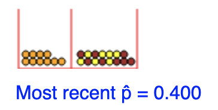
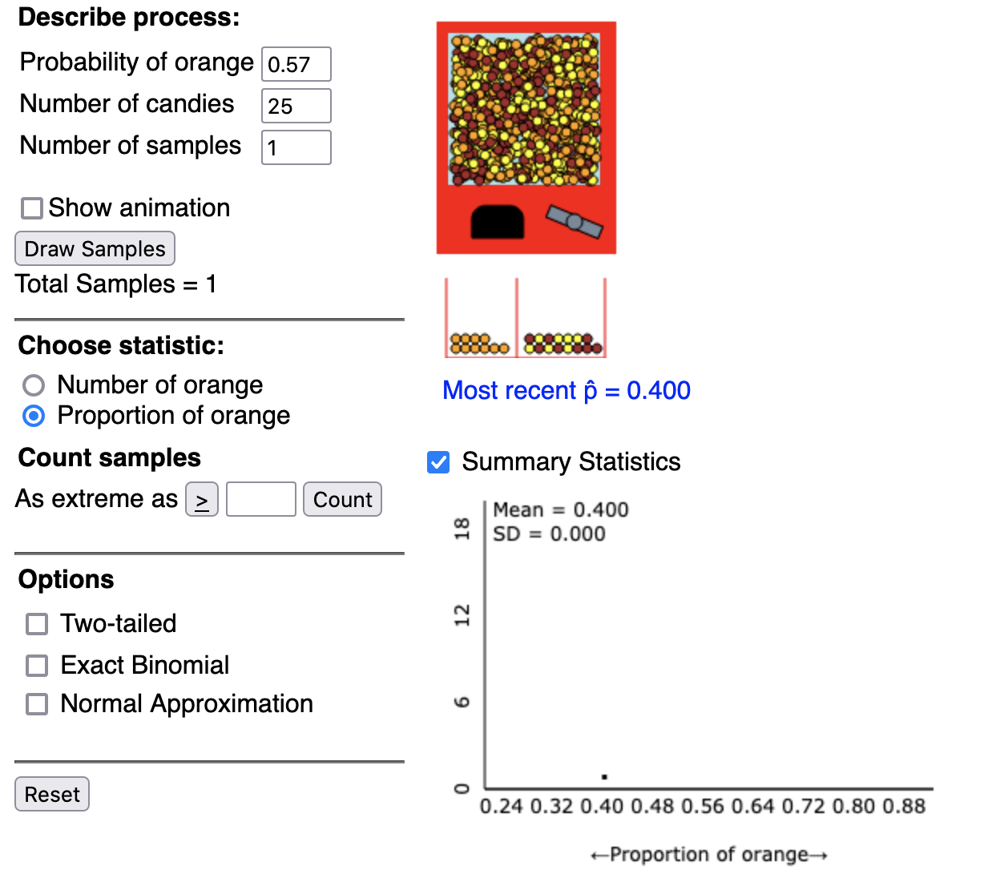
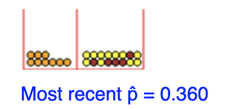

layout: true

```{r setup, include=FALSE}
library(tidyverse)
```
---
class: title-slide


<br>
<br>
.right-panel[ 

# `r rmarkdown::metadata$title`
## `r rmarkdown::metadata$author`

<br>
<br>
Copyright &copy; <a href="https://www.pstat.ucsb.edu/people/uma-ravat">Dr. Uma Ravat</a> &nbsp;&nbsp;<a href="https://creativecommons.org/licenses/by-nc-sa/4.0/">CC BY-NC-SA 4.0</a>
]


---
class: middle 
# Now, let's flip things a bit 

- I do not show you the candy machine or give you any details about it
- I show you one random sample with 25 candy.

.center[

]


- What is best guess/estimate for the proportion of orange candy in the candy machine from which I got my sample?


???
- you can type up your answer in the chat, but wait till i tell you to hit enter
- Put your guesses in the chat
- Since you have one sample proportion (= .4), you probably used it as a point estimate of the population proportion I am asking you to guess. 

---


```{r, echo=FALSE,out.width='65%',fig.align='center'}

```

???
How many of you were correct?
---
class: center middle 

## Quite rare to hit the exact population parameter 
if you simply use the sample statistic  as a point estimate of the population parameter you are trying to estimate. 

---

## This is what happens in reality: 

- You only have one sample - the data that you have observed/collected.
- You do not know the population distribution or parameters. 
- and you need to make _inferences_ about the population parameters based on the one sample you have. 
.pull-left[
```{r, echo=FALSE,out.width='65%',fig.align='center'}

```
]
.pull-right[
```{r, echo=FALSE,out.width='75%',fig.align='center'}

```
]


---
class:  middle 

## Ideas to improve our guesstimate so that we are more likely to include the true population parameter ?

- Think about reasons why using `point estimate` as our guess, we will rarely guess the true population parameter correctly?
    - **Sampling variability**
- If incorporate sampling variability into our guess by  report a range of plausible values around the point estimate, we have a good shot that the range of values  captures the true proportion of orange candy in the candy machine 

---
class: middle 
### How should we incorporate sampling variability (SE) into our estimate/guess for the true population proportion $p$ ?
    

- By CLT, under certain conditions, $\hat{p} \sim  \text{approximately } N(\text{mean} = p, \text{SE} = \sqrt{\frac{p(1-p)}{n}})$
- SE of sampling distribution of $\hat{p}$ can be estimated to be $\sqrt{\frac{\hat{p}(1-\hat{p})}{n}}$ since we do not know the true $p$  and by CLT we can assume $\hat{p}$ is close to $p$.

---
class: middle 
# Confidence intervals

-  are interval estimates (rather than point estimates) that are used to estimate the population parameter
- includes a plausible range of values for the population parameter by incorporating SE to the point estimate.
- are calculated at desired levels of confidence generally 95%,99%, 90%, 80% etc

---
###  95% Confidence Interval  for one proportion

$$\hat{p} \pm 1.96 \times \sqrt{\frac{\hat{p}(1-\hat{p})}{n}}$$ 
- we estimated SE of $\hat{p}$ to be $\sqrt{\frac{\hat{p}(1-\hat{p})}{n}}$ 
- we assume $\hat{p} \sim  \text{approximately normal }$ 
- For a normal distribution 95% of the data falls within `1.96` standard deviations of the mean. 

---
class: middle

.pull-left[

```{r echo=FALSE, out.width = '400px'}

z <- seq(-4, 4, by = 0.01)
y <- dnorm(z)
data <- tibble(z = z, y = y)
qplot(z, y, data = data, 
          geom = "line") +
  geom_ribbon(data = subset(data, z > -1.96 & z <1.96),
                  aes(ymax = y), 
                  ymin = 0,
                  fill = "#1381B0", 
                  colour = NA, 
                  alpha = 0.5) +
  ylab("") +
  scale_x_continuous(breaks = c(-1.96,0,1.96)) +
  annotate(geom = "text", x = 0, y = 0.15, label = "95%") +
  annotate(geom = "text", x = 2.3, y = 0.01, label = "2.5%") +
  annotate(geom = "text", x = - 2.3, y = 0.01, label = "2.5%")

  
```

]

.pull-right[
```{r echo = TRUE}
qnorm(0.975, mean = 0 , sd = 1)
```

```{r echo = TRUE}
qnorm(0.025, mean = 0 , sd = 1)
```
]

---
class: inverse middle center

#  Example 

Calculating a confidence interval

---
.pull-left[
For our candy sample $\hat{p} = 0.4$ 

```{r, echo=FALSE,out.width='45%',fig.align='center'}

```

```{r }
phat = 0.4 # sample proportion
n= 25 # sample size 
SE = round(sqrt((phat*(1-phat))/n),4) 
SE
moe = round(1.96*SE,4) 
moe
```
]

--
.pull-right[
so for this sample 

95% Confidence Interval  is calculated as follows

$$\hat{p} \pm 1.96 \times \sqrt{\frac{\hat{p}(1-\hat{p})}{n}}$$


= `r phat` $\pm$ `1.96*` `r SE` 
<br>
= `r phat` $\pm$ `r round(1.96*SE,4)`
<br>
= (`r phat` $-$ `r round(1.96*SE,4)`,`r phat` $+$ `r round(1.96*SE,4)` )
<br>
= (`r phat-round(1.96*SE,4)`,`r phat+round(1.96*SE,4)` )
<br>
]

---
class: middle

For our candy sample $\hat{p} = 0.4$ 

95% Confidence Interval = (`r phat-round(1.96*SE,4)`,`r phat + round(1.96*SE,4)` )
## Interpreting this confidence interval 
We are 95% confident that the true proportion of orange candy in the candy machine falls between `r phat-moe` and `r phat+moe`.

#### Got it right this time!

 Our interval estimate includes $p = 0.57$!

--
- .important[We only know we are right because I showed you the contents of the candy machine. Otherwise, there is no way to know whether we got it right or wrong.]

---

class: inverse middle


# Activity 1: Calculating Confidence Intervals

1. Go [here](http://www.rossmanchance.com/applets/2021/oneprop/OneProp.htm?candy=1)
2. Draw one candy samples of size 25 from the candy machine with $p = 0.57$
3. build a confidence intervals for this sample
4. Does the interval you constructed include the true $p = 0.57$?
5. Put your answer in the chat. 


---
class: middle

.pull-left[
For another candy sample $\hat{p} = 0.36$ 

```{r, echo=FALSE,out.width='45%',fig.align='center'}

```

```{r }
phat = 0.36
n= 25
SE = round(sqrt((phat*(1-phat))/n),4)
SE
moe = round(1.96*SE,4)
moe
```
]

--
.pull-right[
so for this sample 

95% Confidence Interval  is calculated as follows

$$\hat{p} \pm 1.96 \times \sqrt{\frac{\hat{p}(1-\hat{p})}{n}}$$


= `r phat` $\pm$ `1.96*` `r SE` 
<br>
= `r phat` $\pm$ `r round(1.96*SE,4)`
<br>
= (`r phat` $-$ `r round(1.96*SE,4)`,`r phat` $+$ `r round(1.96*SE,4)` )
<br>
= (`r phat-round(1.96*SE,4)`,`r phat+round(1.96*SE,4)` )
<br>
= (`r phat-moe`,`r phat+moe` )

]

---
class: middle

For another candy sample $\hat{p} = 0.36$ 

95% Confidence Interval = (`r phat-moe`,`r phat+moe`)

### Interpreting this confidence interval 
We are 95% confident that the true proportion of orange candy in the candy machine falls between `r phat-moe` and `r phat+moe`.

#### Got it **wrong** this time!

Our interval estimate **does not** include $p = 0.57$ :(

- .important[We only know we are wrong because I showed you the contents of the candy machine. Otherwise, there is no way to know whether we got it right or wrong.]

---
class: inverse middle 
# Activity 2: Simulating Confidence Intervals
We will draw candy samples of size 25 from the candy machine with $p = 0.57$, build a confidence intervals for each sample and study the confidence intervals 


1. Go [here](http://www.rossmanchance.com/applets/2021/confsim/ConfSim.html)
2. In **Describe process:**
set Statistic = Proportions, Distribution = Binomial, Method = Walds ( since we are using the z-interval), $p$, the population proportion = 0.57, sample size = 25, number of intervals = 1
3. Confidence interval = 95%
4. Click the button Sample a few times


---
class: middle

# Why do we say 95% confidence ? 

Suppose we take many samples and build a confidence interval corresponding to each sample using the equation 

`point estimate ± 1.96×SE`.

then 


- about **95%** of all these intervals we constructed would **contain the true population proportion** $p$ (which is 0.57 in our example) 
- about 5% of all these intervals would not contain the true population proportion $p$


---
class: middle
In other words, to guess the **unknown population parameter**, 

if we use the equation `point estimate ± 1.96×SE` instead of  just guessing `point estimate`,

then the interval we provide will correctly include the unknown population parameter 95% of the time. 

That is **awesome** considering that guessing using just the `point estimate` would most often be wrong ! :-) 

---

class: inverse middle center

# Things about Confidence levels

---
class: middle

# Confidence levels

Commonly used confidence levels in practice are 90%, 95%, 98%, and 99%.

A confidence interval can be calculated using the formula

$$ \text{point estimate} \pm z^\star \times \text{SE} $$ 


- $z^\star$ is called the critical value.
- $z^\star \times SE$ is called the _margin of error_
- width of CI = 2 X margin of error

---
class: middle

#  Width of a confidence interval

If we want to be more certain that we capture the population parameter, i.e. increase our confidence level, should we use a wider interval or a smaller interval?

--

_A wider interval._

---
class: middle

### Can you see any drawbacks to using a wider interval?


--

_If the interval is too wide it may not be very informative._
.footnote[Source: OpenIntro.org]

---
class: middle

# Changing confidence levels 

$$ \text{point estimate} \pm z^\star \times \text{SE} $$ 

In the above formula, for a given sample, 

- point estimate is the sample statistic ( $\hat{p}$ )
- SE is the standard error which is approx $\sqrt{\frac{\hat{p}(1-\hat{p})}{n}}$ 

Thus, as confidence level changes **only** 
-  $z^\star$ in the above formula needs to be adjusted according to confidence level


---
class: middle
### For a 95% confidence interval, why is $z^\star = 1.96$?
.pull-left[

```{r echo=FALSE, out.width = '380px'}

z <- seq(-4, 4, by = 0.01)
y <- dnorm(z)
data <- tibble(z = z, y = y)
qplot(z, y, data = data, 
          geom = "line") +
  geom_ribbon(data = subset(data, z > -1.96 & z <1.96),
                  aes(ymax = y), 
                  ymin = 0,
                  fill = "#1381B0", 
                  colour = NA, 
                  alpha = 0.5) +
  ylab("") +
  scale_x_continuous(breaks = c(-1.96,0,1.96)) +
  annotate(geom = "text", x = 0, y = 0.15, label = "95%") +
  annotate(geom = "text", x = 2.3, y = 0.01, label = "2.5%") +
  annotate(geom = "text", x = - 2.3, y = 0.01, label = "2.5%")

  
```
]

.pull-right[

```{r echo = TRUE}
qnorm(0.025, mean = 0 , sd = 1) 
```

```{r echo = TRUE}
qnorm(0.975, mean = 0 , sd = 1) # critical value
```

]

---
class: middle
# Exercise: 

### What is $z^\star$ for a 98% confidence interval?

--
.pull-left[

```{r echo=FALSE, out.width = '400px'}

z <- seq(-4, 4, by = 0.01)
y <- dnorm(z)
data <- tibble(z = z, y = y)
qplot(z, y, data = data, 
          geom = "line") +
  geom_ribbon(data = subset(data, z > -2.33 & z <2.33),
                  aes(ymax = y), 
                  ymin = 0,
                  fill = "#1381B0", 
                  colour = NA, 
                  alpha = 0.5) +
  ylab("") +
  scale_x_continuous(breaks = c(-2.33,0,2.33)) +
  annotate(geom = "text", x = 0, y = 0.15, label = "98%") +
  annotate(geom = "text", x = 2.5, y = 0.01, label = "1%") +
  annotate(geom = "text", x = - 2.5, y = 0.01, label = "1%")

  
```
]

--
.pull-right[

```{r echo = TRUE}
qnorm(0.01, mean = 0 , sd = 1)
```

```{r echo = TRUE}
qnorm(0.99, mean = 0 , sd = 1) # critical value
```

]

---
class: middle

# Width of the confidence interval 

CI = $\text{point estimate} \pm \text { critical value} \times \text{standard error}$

- Higher level of confidence means larger critical value.
- Larger critical value means higher margin of error.
- Higher margin of error means wider CI.

Thus 99% CI would be the wider compared to 95% CI

---
class: middle

## Constructing Confidence Intervals 

point estimate $\pm$ critical value $\times$ standard error


1. Calculate point estimate.
2. Calculate critical value. Use `R` to calculate this 
3. Calculate standard error.
4. Construct the confidence interval.

---
class: middle
## Confidence Intervals for other population parameters

Confidence Interval = point estimate $\pm$ critical value $\times$ SE of the estimate


|                               | Parameter of Interest | Point Estimate  | critical value | standard error of the estimate                    |
|-------------------------------|-----------------------|-----------------------------------|
| Proportion                    | $p$                 | $\hat{p}$                               |z             | $\sqrt{\frac{p(1-p)}{n}}$                         |
| Mean                          | $\mu$                 | $\bar x$                          |z for large n or t for small n          | $\sqrt{\frac{s^2}{n}}$                         |


$p$ is the sample proportion,
$\bar{x}$ is the sample mean, 
$s^2$ is the sample variance. 

Conditions for CLT should hold to be able to use z as critical value 

---
class: middle
# Conditions for CLT to hold 

- random sample (each observation is independently drawn.)
- for proportions
    - np and n(1-p) large (10 or more)
- for means 
    - sample size n should be large (30 or more)
    - if sample size n is small, then use t distribution with $n-1$ degrees of freedom to find the critical value
    
    
---
class: middle 
# Finding t critical value for 95% CI when $n = 15$

```{r echo= FALSE ,fig.height=3}
x <- seq(-4,4, 0.01)
y <- dt(x, df = 14)
data <- data.frame(x = x, y = y)
qplot(x, y, data = data, 
      geom = "line")+
  geom_ribbon(data = subset(data, x > -2.144787 & x < 2.1447875),
              aes(ymax = y), ymin = 0,
              fill = "#1381B0", colour = NA, alpha = 0.5) +
  scale_y_continuous(limits = c(0, .4)) +
  xlab("t") +
  theme(text = element_text(size = 20))+
  annotate(geom = "text", x = 0, y = 0.15, label = "95%") +
  annotate(geom = "text", x = 2.5, y = 0.01, label = "2.5%") +
  annotate(geom = "text", x = - 2.5, y = 0.01, label = "2.5%")
```

The critical value is:

```{r echo = TRUE}
qt(0.975, df = 14)
```


---
class: middle 

Confidence intervals are ...


- interval estimates for population parameters constructed from a sample 
- only about population parameters, not individual observations
- confidence is in the process used to generate the confidence intervals 
- confidence is not in the fact that the confidence interval contains or does not contain the population parameter

.important[There is no probability associated with a confidence interval. Either the population parameter is in the interval or not.]

---

# Acknowledgement 

Thanks to Dr Mine Dogucu for suggestions for improvement of this material. 

This content has been developed and shaped by referring to several materials including

1. [Dr. Allan Rossman's Ask good questions blog](https://askgoodquestions.blog/)
2. [OpenIntro.org resources](https://www.openintro.org/book/os/)
3. [Dr. Mine Dogucu materials](https://mdogucu.ics.uci.edu/l) 


