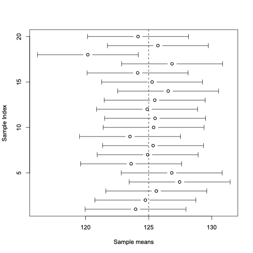

class: title-slide

```{r echo = FALSE}
library(fabricerin)
```

<br>
<br>
.right-panel[ 
<br>

# `r rmarkdown::metadata$title`

### `r rmarkdown::metadata$author`

]


---

### Parameter estimation

- We are interested in population mean and population variance, denoted as  $\mu$ and $\sigma^{2}$ respectively, of a
random variable. 

- These quantities are unknown in general. 

- We refer to these unknown quantities **parameters**.

- In the previous lecture, you learned about statistical methods for parameter **estimation**. 

- Estimation refers to the process of guessing the
unknown value of a parameter (e.g., population mean) using the observed
data. 


---

### Point estimation vs. interval estimation 


- Sometimes we only provide a single value as our estimate: sample mean for population mean and sample variance for population variance.

- This is called **point estimation**. 

- We use $\hat{\mu}$ and $\hat{\sigma}^{2}$ to denote the point estimates for $\mu$ and $\sigma^{2}$. 

- Point estimates do not reflect our uncertainty.

- To address this issue, we can present our estimates in terms of a range of possible values (as opposed to a single value).

- This is called **interval estimation**.

---

### Confidence intervals for the population mean

- When the population variance $\sigma^{2}$ is known, the 95% confidence interval for $\mu$ is
obtained as follows:

$$\begin{equation*}
\bigl[\bar{x} - 2 \times\sigma/ \sqrt{n},\ \bar{x} + 2 \times\sigma/\sqrt{n}\,\bigr]
\end{equation*}$$

- Or in general, we use the $z$-critical value for the confidence level of $c$:

$$\begin{eqnarray*}
[\bar{x} - z_{crit}\times \sigma / \sqrt{n}, \ \bar{x}  + z_{crit} \times \sigma / \sqrt{n}]
\end{eqnarray*}$$

- To find the $z$-critical value given confidence level $c$, we use the standard normal distribution to find the value whose upper tail probability is $(1-c)/2$. 

---

---

### Interpretation of confidence interval

```{r, echo=FALSE,out.width='40%',fig.align='center'}

```


---

### Standard error

- When the population variance, $\sigma^{2}$, is unknown (almost always), we need to estimate $\sigma^{2}$
along with the population mean $\mu$. 

- For this, we use the sample variance $s^{2}$.

- As a result, the standard deviation for the sample mean is estimated to be $s/\sqrt{n}$. 

- We refer to $s/\sqrt{n}$ as the **standard error** of the sample mean.


---

### Confidence Interval When the Population Variance Is Unknown

- To find confidence intervals for the population mean when the population variance is unknown, we follow similar steps as described above, but

  - instead of $\sigma/\sqrt{n}$ we use $\mathit{SE} = s/\sqrt{n}$, 
  - instead of $z_{\mathrm{crit}}$ based on the standard normal distribution, we use $t_{\mathrm{crit}}$ obtained from a $t$-distribution with $n-1$ degrees of freedom. 


- The confidence interval for the population mean at $c$ confidence level is
$$\begin{equation*}
\bigl[\bar{x} - t_{\mathrm{crit}}\times s / \sqrt{n}, \ \bar{x} + t_{\mathrm{crit}} \times s /
\sqrt{n}\,\bigr],
\end{equation*}$$

---


### Margin of error

- We can write the confidence interval as 
$$\begin{equation*}
\bar{x} \pm t_{\mathrm{crit}}\times SE
\end{equation*}$$


- The term $t_{\mathrm{crit}}\times SE$ is called the
**margin of error** for the given confidence level. 


- It is common to present interval estimates for a given confidence level as
$$\begin{equation*}
\textrm{Point estimate} \pm\textrm{Margin of error.}
\end{equation*}$$
