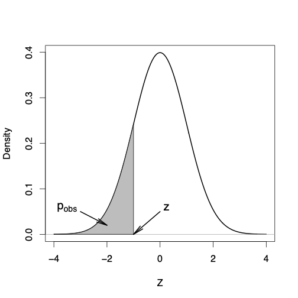

class: title-slide

```{r echo = FALSE}
library(fabricerin)
```

<br>
<br>
.right-panel[ 
<br>

# `r rmarkdown::metadata$title`

### `r rmarkdown::metadata$author`

]


---

### Hypothesis

- In general, many scientific investigations start by expressing a
{hypothesis}. 
- For example, Mackowiak et al (1992) hypothesized that the average normal (i.e., for healthy people) body
temperature is less than the widely accepted value of
$98.6F$. 
- If we denote the population mean of normal
body temperature as $\mu$, then we can express this hypothesis as $\mu
< 98.6$.

---

### Null and alternative hypotheses

- The null hypothesis usually reflects the *status quo* or *nothing of interest*. 
- In contrast, we refer to our hypothesis (i.e., the hypothesis we are investigating through a scientific study) as the *alternative hypothesis* and denote it as~$H_{A}$.
- For hypothesis testing, we focus on the null hypothesis since it tends to be simpler. 


---

### Null and alternative hypotheses

- Consider the body temperature example, where we want to examine the null hypothesis $H_{0}: \mu = 98.6$ against the alternative hypothesis $H_A: \mu < 98.6$. 
- To start, suppose that $\sigma^{2} = 1$ is known.
- Further, suppose that we have randomly selected a sample of 25 healthy people from the population and measured their body temperature.


---

### Hypothesis testing for the population mean

- To decide whether we should reject the null hypothesis, we quantify the
empirical support (provided by the observed data) against the null
hypothesis using some statistics. 

- We use statistics to evaluate our
hypotheses. 

- We refer to them as *test statistics*. 

- For a statistic to be considered as a test statistic, its sampling
distribution must be fully known (exactly or approximately) under the
null hypothesis. 

- We refer to the distribution of test statistics under
the null hypothesis as the *null distribution*. 


---

### Hypothesis testing for the population mean

- To evaluate hypotheses regarding the population mean, we use the sample mean $\bar{X}$ as the test statistic.
$$\begin{equation*}
\bar{X}   \sim  N\bigl(\mu, \sigma^{2}/n\bigr).
\end{equation*}$$

- For the above example, 
$$\begin{equation*}
\bar{X}   \sim  N\bigl(\mu, 1/25\bigr).
\end{equation*}$$

- If the null hypothesis is true, then
$$\begin{equation*}
\bar{X}   \sim  N\bigl(98.6, 1/25\bigr).
\end{equation*}$$


---

### Hypothesis testing for the population mean

- In reality, we have one value, $\bar{x}$, for the sample mean. 

- We can use this value to quantify the evidence of departure from the null
hypothesis. 

- Suppose that from our sample of 25 people we find that the sample mean
is $\bar{x} = 98.4$. 


---

### Hypothesis testing for the population mean

- To evaluate the null hypothesis $H_{0}: \mu = 98.6$
versus the alternative $H_{A}: \mu < 98.6$, we use the lower tail
probability of this value from the null distribution. 

```{r, echo=FALSE,out.width='25%',out.height='60%',fig.align='center'}
knitr::include_graphics('img/pValLower.png')
```


---

### Observed significance level

- The *observed significance level* for a test is the probability of values
as or more extreme than the observed value, based on the null
distribution in the direction supporting the alternative hypothesis. 

- This probability is also called the $p$-*value*}* and denoted $p_{\mathrm{obs}}$.

- For the above example, 
$$\begin{equation*}
p_{\mathrm{obs}} = P(\bar{X}  \le \bar{x} | H_{0}),
\end{equation*}$$


---

### z-score

In practice, it is more common to use the standardized version of the
sample mean as our test statistic. 
- We know that if a random variable is
normally distributed (as it is the case for $\bar{X}$), subtracting the
mean and dividing by standard deviation creates a new random variable
with standard normal distribution,
$$\begin{equation*}
Z   \sim  N(0,  1).
\end{equation*}$$

---

### z-score

- We refer to the standardized value of the observed test statistic as
the $z$-*score*,
$$\begin{eqnarray*}
z  & = & \frac{\bar{x} - \mu_{0}}{\sigma/\sqrt{n}},\\
 & = & \frac{98.4 - 98.6}{0.2} = -1.
\end{eqnarray*}$$

---

### z-test

We refer to the corresponding hypothesis test of the
population mean as the $z$-*test*. 

- In a $z$-test, instead of comparing
the observed sample mean $\bar{x}$ to the population mean according to
the null hypothesis, we compare the $z$-score to 0. 


---

### z-test

```{r, echo=FALSE,out.width='25%',out.height='60%',fig.align='center'}
knitr::include_graphics('img/pValLower.png')
```

---

### z-test

```{r, echo=FALSE,out.width='25%',out.height='60%',fig.align='center'}

```

