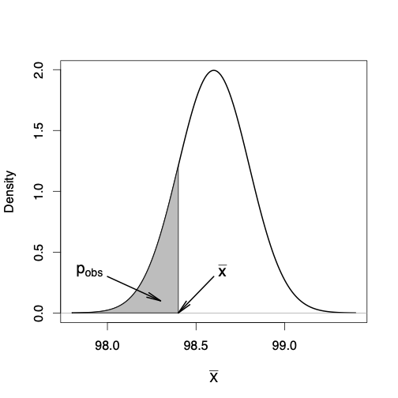

class: title-slide

```{r echo = FALSE}
library(fabricerin)
```

<br>
<br>
.right-panel[ 
<br>

# `r rmarkdown::metadata$title`

### `r rmarkdown::metadata$author`

]


---

class: middle 
<!-- Other types of class center and inverse -->

### Hypothesis

- In general, many scientific investigations start by expressing a **hypothesis**. 

- For example, Mackowiak et al (1992) hypothesized that the average normal (i.e., for healthy people) body temperature is less than the widely accepted value of $98.6F$. 

- If we denote the population mean of normal body temperature as $\mu$, then we can express this hypothesis as $\mu < 98.6$.

---

### Null and alternative hypotheses

- The null hypothesis usually reflects the *status quo* or *nothing of interest*. 

- In contrast, we refer to our hypothesis (i.e., the hypothesis we are investigating through a scientific study) as the *alternative hypothesis* and denote it as $H_{A}$.

- For hypothesis testing, we focus on the null hypothesis since it tends to be simpler. 


---

### Null and alternative hypotheses

- Consider the body temperature example, where we want to examine the null hypothesis $$H_{0}: \mu = 98.6$$ against the alternative hypothesis $$H_A: \mu < 98.6$$. 

- To start, suppose that $\sigma^{2} = 1$ is known.

- Further, suppose that we have randomly selected a sample of 25 healthy people from the population and measured their body temperature.


---

### Hypothesis testing for the population mean

- To decide whether we should reject the null hypothesis, we quantify the
empirical support (provided by the observed data) against the null
hypothesis using some statistics. 

- We use statistics to evaluate our
hypotheses. 

- We refer to them as *test statistics*. 

- For a statistic to be considered as a test statistic, its sampling
distribution must be fully known (exactly or approximately) under the
null hypothesis. 

- We refer to the distribution of test statistics under
the null hypothesis as the *null distribution*. 


---

### Hypothesis testing for the population mean

- To evaluate hypotheses regarding the population mean, we use the sample mean $\bar{X}$ as the test statistic.
$$\begin{equation*}
\bar{X}   \sim  N\bigl(\mu, \sigma^{2}/n\bigr).
\end{equation*}$$

- For the above example, 
$$\begin{equation*}
\bar{X}   \sim  N\bigl(\mu, 1/25\bigr).
\end{equation*}$$

- If the null hypothesis is true, then
$$\begin{equation*}
\bar{X}   \sim  N\bigl(98.6, 1/25\bigr).
\end{equation*}$$


---

### Hypothesis testing for the population mean

- In reality, we have one value, $\bar{x}$, for the sample mean. 

- We can use this value to quantify the evidence of departure from the null
hypothesis. 

- Suppose that from our sample of 25 people we find that the sample mean
is $\bar{x} = 98.4$. 


---

### Hypothesis testing for the population mean

- To evaluate the null hypothesis $H_{0}: \mu = 98.6$
versus the alternative $H_{A}: \mu < 98.6$, we use the lower tail
probability of this value from the null distribution. 

```{r, echo=FALSE,out.width='30%',out.height='60%',fig.align='center'}

```


---

### Observed significance level

- The *observed significance level* for a test is the probability of values
as or more extreme than the observed value, based on the null
distribution in the direction supporting the alternative hypothesis. 

- This probability is also called the **p-value** and denoted $p_{\mathrm{obs}}$.

- For the above example, 
$$\begin{equation*}
p_{\mathrm{obs}} = P(\bar{X}  \le \bar{x} | H_{0}),
\end{equation*}$$


---

### Interpretation of $p$-value


- The $p$-value is the conditional probability of extreme values (as or
more extreme than what has been observed) of the test statistic assuming that the null hypothesis is true. 

- When the $p$-value is small, say 0.01 for example, it is rare to find values as extreme as what we have observed (or more so). 

- As the $p$-value increases, it indicates that there is a good chance to find more extreme values (for the test statistic) than what has been observed. 

- Then, we would be more reluctant to reject the null hypothesis.

- A common *mistake* is to regard the $p$-value as the probability of null given the observed test statistic:
$P(H_{0} | \bar{X} = \bar{x})$. 


---

### One-sided vs. two-sided hypothesis testing


- The alternative hypothesis $H_{A}: \mu < 98.6$ or $H_{A}: \mu > 98.6$ are called *one-sided* alternatives. 

- For these hypotheses, $p_{\mathrm{obs}} = P( \bar{X} \le \bar{x} | H_0)$ and $p_{\mathrm{obs}} = P(\bar{X} \ge \bar{x}| H_0)$ respectively.

- In contrast, the alternative hypothesis $H_{A}: \mu \ne 98.6$ is *two-sided*. 

- For the above three alternatives, the null hypothesis is the same, $H_{0}: \mu = 98.6$

- In this case, $p_{\mathrm{obs}} = 2 \times P(\bar{X} \geq |\bar{x}| | H_0)$.

---

### Hypothesis testing using $t$-tests


- So far, we have assumed that the population variance
$\sigma^{2}$ is known. 

- In reality,
$\sigma^{2}$ is almost always unknown, and we need to estimate it from
the data. 

- As before, we estimate $\sigma^{2}$ using the sample variance
$S^{2}$. 

- Similar to our approach
for finding confidence intervals, we account for this additional source
of uncertainty by using the $t$-distribution with $n-1$ degrees of
freedom instead of the standard normal distribution. 

- The hypothesis
testing procedure is then called the **t-test**.


---

### Hypothesis testing using $t$-tests


- Using the observed values of $\bar{X}$ and $S$, the observed value of
the test statistic is obtained as follows: $t  =  \frac{\bar{x} - \mu_{0}}{s/\sqrt{n}}$.

- We refer to $t$ as the $t$-*score*. Then,
$$\begin{array}{l@{\quad}l}
\mbox{if}\ H_{A}: \mu < \mu _0, &  p_{\mathrm{obs}} = P(T \leq t), \\
\mbox{if}\ H_{A}: \mu > \mu _0, & p_{\mathrm{obs}} = P(T \geq t ), \\
\mbox{if}\ H_{A}: \mu \ne \mu _0, & p_{\mathrm{obs}} = 2 \times P\bigl(T \geq | t | \bigr),
\end{array}$$

- Here, $T$ has a $t$-distribution with $n-1$ degrees of freedom, and $t$
is our observed $t$-score. 


---

### Hypothesis testing for population proportion


- For a binary random variable $X$ with possible values 0 and 1, we are
typically interested in evaluating hypotheses regarding the population
proportion of the outcome of interest, denoted as $X=1$. 
 
- As discussed before, the population proportion is the same as the population mean for such binary variables.

- So we follow the same procedure as described above. 
- More specifically,
we use the $z$-test for hypothesis testing. 


---

### Hypothesis testing for population proportion

- Note that we do not use
$t$-test, because for binary random variable, population variance is
$\sigma^{2}=\mu(1-\mu)$. 

- Therefore, by setting $\mu=\mu_{0}$ according
to the null hypothesis, we also specify the population variance as
$\sigma^{2} = \mu_{0}(1-\mu_{0})$.

---

### Hypothesis testing for population proportion

- If we assume that the null hypothesis is true, we have
$$\begin{equation*}
\bar{X}| H_{0}  \sim  N\bigl(\mu_{0},  \mu_{0}(1-\mu_{0})/n\bigr).
\end{equation*}$$


