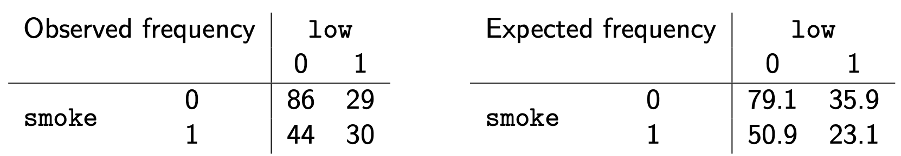

class: title-slide

```{r echo = FALSE}
library(fabricerin)
```

<br>
<br>
.right-panel[ 
<br>

# `r rmarkdown::metadata$title`

### `r rmarkdown::metadata$author`

]


---

### Objective

- We now discuss hypothesis testing regarding possible relationships between two variables. 

- We first focus on problems where we are investigating the
relationship between one binary categorical variable (e.g., gender) and
one numerical variable (e.g., body temperature).  

- Later, we discuss the relationship between two categorical variables (e.g., treatment and survival status).

---

### Relationship Between a Numerical Variable and a Binary Variable

- In these situations, the binary variable typically represents two different groups or two different experimental conditions. 

- We treat the binary variable (factor) as the explanatory variable in our analysis. 

- The numerical variable, on the other hand, is regarded as the response (target) variable (e.g., body temperature).

---

### Relationship Between a Numerical Variable and a Binary Variable


- In general, we can denote the means of the two groups as $\mu_{1}$ and
$\mu_{2}$. 

- The null hypothesis indicates that the population means are equal,
$H_{0}: \mu_{1} = \mu_{2}$. 

- In contrast, the alternative hypothesis is one the following:
$$\begin{array}[t]{l@{\quad}p{6.7cm}}
H_{A}: \mu_{1} > \mu_{2} \\
H_{A}: \mu_{1} < \mu_{2}   \\
H_{A}: \mu_{1} \ne \mu_{2}  \\
\end{array}$$

---

### Relationship Between a Numerical Variable and a Binary Variable


- We can also express these hypotheses in terms of the
*difference* in the means: 

$$H_{A}: \mu_{1}  - \mu_{2} > 0$$
$$H_{A}: \mu_{1} - \mu_{2} < 0$$
$$H_{A}: \mu_{1} - \mu_{2} \ne 0$$.
- Then the corresponding null hypothesis is that there is no difference
in the population means, $$H_{0}: \mu_{1} - \mu_{2} = 0$$.


---

### Relationship Between a Numerical Variable and a Binary Variable


- Previously, we used the sample mean $\bar{X}$ to perform statistical
inference regarding the population mean $\mu$. 

- To evaluate our
hypothesis regarding the difference between two means, $\mu_{1} - \mu_{2}$, it is reasonable to choose the difference between the sample
means, $\bar{X}_{1} - \bar{X}_{2}$, as our statistic. 

- We use the following notations:
$$\begin{eqnarray*}
\mu_{12} & = & \mu_{1} - \mu_{2},\\
\bar{X}_{12} & = & \bar{X}_{1} - \bar{X}_{2}.
\end{eqnarray*}$$

---

### Relationship Between a Numerical Variable and a Binary Variable

- By the Central Limit Theorem,
$$\begin{eqnarray*}
\bar{X}_{1} & \sim & N\bigl(\mu_{1}, \sigma^{2}_{1}/n_{1}\bigr),\\
\bar{X}_{2} & \sim & N\bigl(\mu_{2}, \sigma^{2}_{2}/n_{2}\bigr),
\end{eqnarray*}$$
where $n_{1}$ and $n_{2}$ are the number of observations

- Therefore, 
$$\begin{equation*}
\bar{X}_{12}  \sim N\bigl(\mu_1 - \mu_2,\ \sigma^{2}_{1}/n_{1} + \sigma^{2}_{2}/n_{2}\bigr).
\end{equation*}$$
---

### Relationship Between a Numerical Variable and a Binary Variable

- We can rewrite this as
$$\begin{equation*}
\bar{X}_{12}  \sim N\bigl(\mu_{12},\ \mathit{SD}_{12}^{2}\bigr).
\end{equation*}$$
where
$$\begin{equation*}
\mathit{SD}_{12}  =  \sqrt{ \sigma^{2}_{1}/n_{1} + \sigma^{2}_{2}/n_{2} }.
\end{equation*}$$


---

### Relationship Between a Numerical Variable and a Binary Variable

- We want to test our hypothesis that $H_{A}: \mu_{12} \ne 0$ (i.e., the
difference between the two means is not zero) against the null
hypothesis that $H_{0}: \mu_{12} = 0$. 

- To use $\bar{X}_{12}$ as a test
statistic, we need to find its sampling distribution under the null
hypothesis (i.e., its null distribution).

- If the null hypothesis is true, then $\mu_{12} = 0$. Therefore, the
null distribution of $\bar{X}_{12}$ is
$$\begin{equation*}
\bar{X}_{12}  \sim N\bigl(0, \mathit{SD}_{12}^{2}\bigr).
\end{equation*}$$


---

### Two-Sample $t$-test

- In practice, $SD_{12}$ is not known since $\sigma_{1}$ and $\sigma_{2}$ are unknown. 

- We can estimate it as follows:
$$\begin{eqnarray*}
\mathit{SE}_{12} = \sqrt{s^{2}_{1}/n_{1} + s^{2}_{2}/n_{2} },
\end{eqnarray*}$$
where $\mathit{SE}_{12}$ is the \emph{standard error} of $\bar{X}_{12}$.

- Then, instead of the standard normal distribution, we need to use $t$-distributions to find $p$-values.

- For this, we can use the `t.test()` function in R.

---

### Paired $t$-test

- While we hope that the two samples taken from the population are
comparable except for the characteristic that defines the grouping,
this is not guaranteed in general. 

- To mitigate the influence of other important factors (e.g., age) that are not the focus
of our study, we sometimes **pair** (match) each individual in one group with an
individual in the other group so that the paired individuals are very
similar to each other except for the variable that defines the
grouping. 

- For example, we might recruit twins and assign one of them to the treatment group and the other one to the placebo group.

- Sometimes, the subjects in the two groups are the same individuals under two different conditions. 


---

### Paired $t$-test

- When the individuals in the two groups are paired, we use the **paired**
$t$-test to take the pairing of the observations between the two
groups into account.

- Using the difference, $D$, between the paired observations, the
hypothesis testing problem reduces to a single sample $t$-test problem.


---

### Relationship between two categorical variables

- We will discuss Pearson's $\boldsymbol{\chi}^{\mathbf{2}}$
(chi-squared) test for testing hypotheses regarding the relationship between two categorical
variables. 

- Pearson's $\chi^{2}$ test uses a test statistic, which we
denote as $Q$, to measure the discrepancy between the observed data and
what we expect to observe under the null hypothesis (i.e., assuming the null
hypothesis is true).

- The null hypothesis in this case states that the two variables are independent. 

- Recall that for two independent random variables, the joint
probability is equal to the product of their individual probabilities.


---

### Pearson's $\chi^{2}$ Test of Independence

- As discussed before, we can use contingency tables to find the observed frequencies for different combinations of categories of the two variables. 

- We denote the **observed** frequency in row $i$ and column $j$ as $O_{ij}$.

- Using the independence rule, we can find the **expected** frequencies under the null hypothesis. 

- We denote the expected frequency in row $i$ and column $j$ as $E_{ij}$.

---

### Pearson's $\chi^{2}$ Test of Independence

- Pearson's
$\chi^{2}$ test summarizes the differences between the expected
frequencies (under the null hypothesis) and the observed frequencies
over all cells of the contingency table,

$$\begin{equation*}
Q =  \sum_{i} \sum_{j} \frac{(O_{ij} - E_{ij})^{2}}{E_{ij}}.
\end{equation*}$$

- For $I\times J$ contingency tables (i.e., $I$ rows and $J$
columns), the $Q$ statistic has approximately the $\chi^2$ distribution
with $(I-1)\times(J-1)$ degrees of freedom under the null.


---

### Smoking and low birthweight babies

- We can create observed and expected contingency tables, and find the observed significance level. 

```{r, echo=FALSE,out.width='70%',out.height='40%',fig.align='center'}

```

- Then Pearson's test statistic is 
$$\begin{eqnarray*}
Q &=& \frac{(O_{11} - E_{11} )^2}{E_{11}} + \frac{(O_{12} - E_{12} )^2}{E_{12}} + \frac{(O_{21} - E_{21})^2}{E_{21}}  + \frac{(E_{22} - E_{22})^2}{E_{22}} \\
q &=& \frac{(86 - 79.1 )^2}{79.1} + \frac{(29 - 35.9 )^2}{35.9} + \frac{(44 - 50.9)^2}{50.9}  + \frac{(30 - 23.1)^2}{23.1} = 4.9
\end{eqnarray*}$$


---

### Smoking and low birthweight babies

- Because the table has $I=2$ rows and $J=2$ columns, the approximate null distribution of $Q$ is $\chi^{2}$ with $(2-1)\times (2-1) = 1$ degrees of freedom. 

- Consequently, the observed $p$-value is the upper tail probability of 4.9 using $\chi^2(1)$ distribution.

- For this example, $p$-value = 0.026.

- In practice, we simply use the `chisq.test()` in R.
