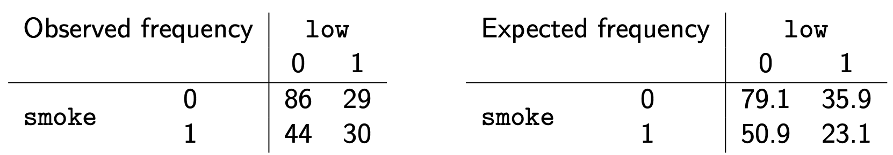

class: title-slide

```{r echo = FALSE}
library(fabricerin)
```

<br>
<br>
.right-panel[ 
<br>

# `r rmarkdown::metadata$title`

### `r rmarkdown::metadata$author`

]

---

### ntroduction

- We will discuss Pearson's $\boldsymbol{\chi}^{\mathbf{2}}$
(chi-squared) test for testing hypotheses regarding the relationship between two categorical
variables. 

- Pearson's $\chi^{2}$ test uses a test statistic, which we
denote as $Q$, to measure the discrepancy between the observed data and
what we expect to observe under the null hypothesis (i.e., assuming the null
hypothesis is true).

- The null hypothesis in this case states that the two variables are independent. 

- Recall that for two independent random variables, the joint
probability is equal to the product of their individual probabilities.


---

### Pearson's $\chi^{2}$ Test of Independence

- As discussed before, we can use contingency tables to find the observed frequencies for different combinations of categories of the two variables. 

- We denote the *observed* frequency in row $i$ and column $j$ as $O_{ij}$.

- Using the independence rule, we can find the *expected* frequencies under the null hypothesis. 

- We denote the
expected frequency in row $i$ and column $j$ as $E_{ij}$.

---

### Pearson's $\chi^{2}$ Test of Independence

- Pearson's
$\chi^{2}$ test summarizes the differences between the expected
frequencies (under the null hypothesis) and the observed frequencies
over all cells of the contingency table,

$$\begin{equation*}
Q =  \sum_{i} \sum_{j} \frac{(O_{ij} - E_{ij})^{2}}{E_{ij}}.
\end{equation*}$$

- For $I\times J$ contingency tables (i.e., $I$ rows and $J$
columns), the $Q$ statistic has approximately the $\chi^2$ distribution
with $(I-1)\times(J-1)$ degrees of freedom under the null.

---

### Pearson's $\chi^{2}$ Test of Independence

- Therefore, we can calculate the observed significance level by finding the upper
tail probability of the observed value for $Q$, which we denote as $q$,
based on the $\chi^{2}$ distribution
with $(I-1)\times(J-1)$ degrees of freedom.


---

### Smoking and low birthweight babies

- We can create observed and expected contingency tables, and find the observed significance level. 

```{r, echo=FALSE,out.width='70%',out.height='40%',fig.align='center'}

```

- Then Pearson's test statistic is 
$$\begin{eqnarray*}
Q &=& \frac{(O_{11} - E_{11} )^2}{E_{11}} + \frac{(O_{12} - E_{12} )^2}{E_{12}} + \frac{(O_{21} - E_{21})^2}{E_{21}}  + \frac{(E_{22} - E_{22})^2}{E_{22}} \\
q &=& \frac{(86 - 79.1 )^2}{79.1} + \frac{(29 - 35.9 )^2}{35.9} + \frac{(44 - 50.9)^2}{50.9}  + \frac{(30 - 23.1)^2}{23.1} = 4.9
\end{eqnarray*}$$


---

### Smoking and low birthweight babies

- Because the table has $I=2$ rows and $J=2$ columns, the approximate null distribution of $Q$ is $\chi^{2}$ with $(2-1)\times (2-1) = 1$ degrees of freedom. 

- Consequently, the observed $p$-value is the upper tail probability of 4.9 using $\chi^2(1)$ distribution.

- For this example, $p$-value = 0.026.
