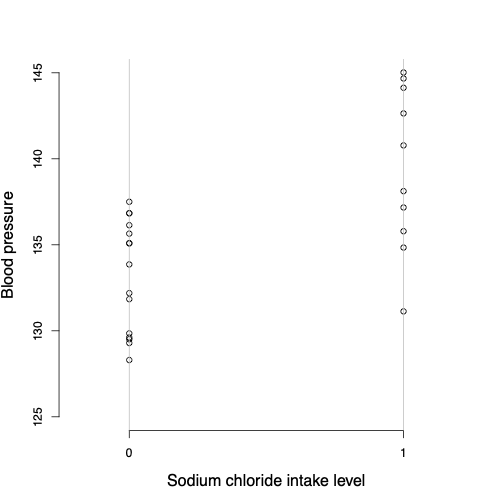
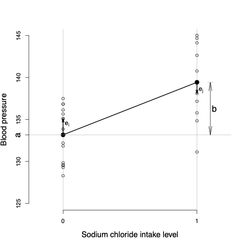
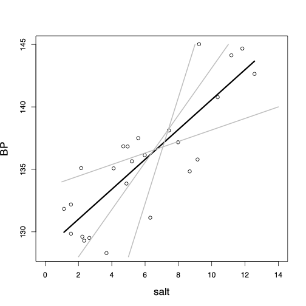

class: title-slide

```{r echo = FALSE}
library(fabricerin)
```

<br>
<br>
.right-panel[ 
<br>

# `r rmarkdown::metadata$title`

### `r rmarkdown::metadata$author`

]


---

### Introduction


- We now discuss **linear regression models** for either testing a hypothesis
regarding the relationship between one or more **explanatory variables** and a response variable, or **predicting** unknown values of the
response variable using one or more **predictors**.

- We use $X$ to denote explanatory variables and $Y$ to
denote response variables. 

- We start by focusing on problems where the explanatory
variable is binary. As before, the binary variable $X$ can be
either 0 or 1. 

- We then continue our discussion for situations
where the explanatory variable is numerical.


---

### One Binary Explanatory Variable


- Suppose that we want to investigate the relationship between sodium
chloride (salt) consumption (low vs. high consumption) and blood pressure among elderly people
(e.g., above 65 years old). 

```{r, echo=FALSE,out.width='32%',out.height='40%',fig.align='center'}

```


---

### One Binary Explanatory Variable


- The following figure shows the dot plot along with sample means, shown as black circles, for each group. 

- We connect the two sample means to show the overall pattern for how blood pressure changes from one
group to another.

```{r, echo=FALSE,out.width='27%',out.height='40%',fig.align='center'}

```


---

### One Binary Explanatory Variable


- Using the intercept $a$ and slope $b$, we can write the equation for
the straight line that connects the estimates of the response variable for different values of $X$ as follows:
$$\begin{equation*}
\hat{y}  =  a + b x.
\end{equation*}$$

- The slope is also knows as the **regression coefficient** of $X$.

- For this example,
$$\begin{equation*}
\hat{y}  =  133.17 + 6.25 x.
\end{equation*}$$

---

### One Binary Explanatory Variable

- We expect that on average the blood
pressure increases by 6.25 units for one unit increase in $X$. 

- In this case, one unit increase in $X$ from 0
to 1 means moving from low to high sodium chloride
diet group.


---

### One Binary Explanatory Variable

- For an individual with $x=0$ (i.e., low sodium chloride diet), the estimate according to the above regression line is
$$\begin{eqnarray*}
\hat{y} & = & a + b \times 0 = a \\
& = & \hat{y}_{x=0},
\end{eqnarray*}$$
which is the sample mean for the first group. 


---

### One Binary Explanatory Variable

- For an individual with $x=1$ (i.e., high sodium chloride diet), the estimate according to the above regression line is
$$\begin{eqnarray*}
\hat{y} & = & a + b \times 1 = a+b \\
& = & \hat{y}_{x=0} + \hat{y}_{x=1} - \hat{y}_{x=0} \\
& = & \hat{y}_{x=1}.
\end{eqnarray*}$$


---

### One Binary Explanatory Variable


- We refer to the difference between the observed and estimated values of
the response variable as the **residual**. 

- For individual $i$, we denote the residual $e_{i}$ and calculate it as follows:
$$\begin{equation*}
e_{i}  =  y_{i} - \hat{y}_{i}.
\end{equation*}$$

- For instance, if someone belongs to the first group, her estimated blood pressure is $\hat{y}_{i} = a =133.17$. 

- Now if the observed value of her blood pressure is $y_{i} = 135.08$, then the residual is
$$\begin{equation*}
e_{i}  = 135.08 - 133.17 = 1.91.
\end{equation*}$$


---

### Residual sum of squares

- As a measure of discrepancy between the observed values and those
estimated by the line, we calculate the **Residual Sum of
Squares** (RSS):
$$\begin{equation*}
\mathit{RSS} =  \sum_{i}^{n} e_{i}^{2}.
\label{RSS}
\end{equation*}$$

- Here, $e_i$ is the residual of the $i$th observation, and $n$ is the
sample size. 

- The square of each residual is used so that its sign becomes irrelevant.

---

### One Numerical Explanatory Variable


- We now discuss simple linear regression models (i.e., linear regression with only one explanatory variable), where the explanatory variable is numerical.

```{r, echo=FALSE,out.width='35%',out.height='40%',fig.align='center'}
knitr::include_graphics('img/bpBySalt.png')
```


---

### One Numerical Explanatory Variable


- Among all possible lines we can pass through the data, we choose the one with the smallest sum of squared residuals. The resulting line is called the **least-squares regression line**.


```{r, echo=FALSE,out.width='33%',out.height='40%',fig.align='center'}

```


---

### Statistical inference using regression models

- We can use the function `lm()` or `glm()` in R to find the least-squares regression line. 

- The slope of the regression line plays an important role in evaluating the relationship between the response variable and explanatory variable(s).

- We can also use this regression line to predict the unknown value of the response variable. 


---

### Prediction


- Using the regression line, we can estimate the unknown value of the response variable for members of the population who did not participate in our study. 

- In this case, we refer to our estimates as **predictions**. 

- For example, we can use the linear regression model we built previously to predict the value of blood pressure for a person with high sodium chloride diet (i.e., $x=1$),

$$\begin{eqnarray*}
\hat{y} & = &  133.17 + 6.25 x\\
 & = & 133.17 + 6.25 \times 1\\
 & = & 139.42.
\end{eqnarray*}$$


---

### Confidence interval


- We can find the confidence interval for the population regression coefficient as follows:

$$\begin{equation*}
[b - t_{\mathrm{crit}} \times \mathit{SE}_{b}, b + t_{\mathrm{crit}} \times \mathit{SE}_{b}].
\end{equation*}$$

- For simple (i.e., one predictor) linear regression models, $\mathit{SE}_{b}$ is obtained as follows:

$$\begin{equation*}
\label{eq:seb3}
\mathit{SE}_{b}  =
\frac{\sqrt{\mathit{RSS}/(n-2)}}{\sqrt{\sum_{i} (x_{i} - \bar{x})^2}}.
\end{equation*}$$

- The corresponding $t_{\mathrm{crit}}$ is obtained from the $t$-distribution with ${n-2}$ degrees of freedom.


---

### Hypothesis testing

- To assess the null hypothesis that the population regression coefficient is zero, which is interpreted
as no linear relationship between the response variable and the explanatory variable, we first calculate the $t$-score.

$$\begin{equation*}
t = b/\mathit{SE}_{b}
\end{equation*}$$

- Then, we find the corresponding $p$-value as follows, where $T$ has the $t$-distribution with $n-2$ degrees of freedom:

$$\begin{array}{l@{\quad}l}
\mbox{if}\ H_{A}: \beta < 0, & p_{\mathrm{obs}} = P(T \leq t), \\
\mbox{if}\ H_{A}: \beta > 0, & p_{\mathrm{obs}} = P(T \geq t ), \\
\mbox{if}\ H_{A}: \beta \ne 0, & p_{\mathrm{obs}} = 2 \times P\bigl(T \geq | t | \bigr),
\end{array}$$


