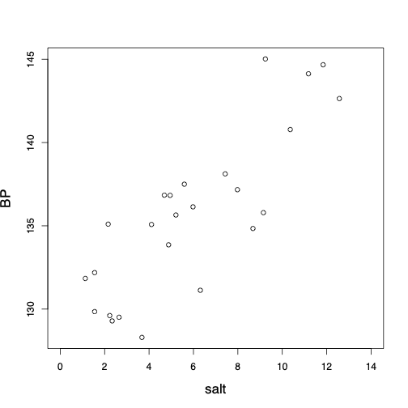

class: title-slide

```{r echo = FALSE}
library(fabricerin)
```

<br>
<br>
.right-panel[ 
<br>

# `r rmarkdown::metadata$title`

### `r rmarkdown::metadata$author`

]


---

### Introduction

- We now discuss **simple linear regression** models, where the objective is to either explain the variation in a numerical **response variable** or predict its unknown values using another variable called **explanatory variable** or **predictor** (depending its role).

- We use $X$ to denote explanatory variable and $Y$ to denote response variable. 

- We start by focusing on problems where the explanatory variable is binary. As before, the binary variable $X$ can be either 0 or 1. 

- We then continue our discussion for situations where the explanatory variable is numerical.


---

### One Binary Explanatory Variable


- Suppose that we want to investigate the relationship between sodium chloride (salt) consumption (low vs. high consumption) and blood pressure among elderly people (e.g., above 65 years old). 

```{r, echo=FALSE,out.width='32%',out.height='40%',fig.align='center'}
knitr::include_graphics('img/saltBP0.png')
```


---

### One Binary Explanatory Variable


- The following figure shows the dot plot along with sample means, shown as black circles, for each group. We connect the two sample means to show the overall pattern for how blood pressure changes from one
group to another.

```{r, echo=FALSE,out.width='32%',out.height='40%',fig.align='center'}
knitr::include_graphics('img/saltBP1.png')
```


---

### One Binary Explanatory Variable


- Using the intercept $a$ and slope $b$, we can write the equation for
the straight line that connects the estimates of the response variable for different values of $X$ as follows:
$$\begin{equation*}
\hat{y}  =  a + b x.
\end{equation*}$$

- The slope is also knows as the **regression coefficient** of $X$.

- For this example,
$$\begin{equation*}
\hat{y}  =  133.17 + 6.25 x.
\end{equation*}$$

---

### One Binary Explanatory Variable

- We expect that on average the blood
pressure increases by 6.25 units for one unit increase in $X$. 

- In this case, one unit increase in $X$ from 0
to 1 means moving from low to high sodium chloride
diet group.


---

### One Binary Explanatory Variable

- For an individual with $x=0$ (i.e., low sodium chloride diet), the estimate according to the above regression line is
$$\begin{eqnarray*}
\hat{y} & = & a + b \times 0 = a \\
& = & \hat{y}_{x=0},
\end{eqnarray*}$$
which is the sample mean for the first group. 


---

### One Binary Explanatory Variable

- For an individual with $x=1$ (i.e., high sodium chloride diet), the estimate according to the above regression line is
$$\begin{eqnarray*}
\hat{y} & = & a + b \times 1 = a+b \\
& = & \hat{y}_{x=0} + \hat{y}_{x=1} - \hat{y}_{x=0} \\
& = & \hat{y}_{x=1}.
\end{eqnarray*}$$


---

### One Binary Explanatory Variable


- We refer to the difference between the observed and estimated values of
the response variable as the **residual**. 

- For individual $i$, we denote the residual $e_{i}$ and calculate it as follows:
$$\begin{equation*}
e_{i}  =  y_{i} - \hat{y}_{i}.
\end{equation*}$$

- For instance, if someone belongs to the first group, her estimated blood pressure is $\hat{y}_{i} = a =133.17$. 

- Now if the observed value of her blood pressure is $y_{i} = 135.08$, then the residual is
$$\begin{equation*}
e_{i}  = 135.08 - 133.17 = 1.91.
\end{equation*}$$


---

### Residual sum of squares

- As a measure of discrepancy between the observed values and those
estimated by the line, we calculate the **Residual Sum of
Squares** (RSS):
$$\begin{equation*}
\mathit{RSS} =  \sum_{i}^{n} e_{i}^{2}.
\label{RSS}
\end{equation*}$$

- Here, $e_i$ is the residual of the $i$th observation, and $n$ is the
sample size. 

- The square of each residual is used so that its sign becomes irrelevant.

---

### One Numerical Explanatory Variable


- We now discuss simple linear regression models (i.e., linear regression with only one explanatory variable), where the explanatory variable is numerical.

```{r, echo=FALSE,out.width='35%',out.height='40%',fig.align='center'}

```


---

### One Numerical Explanatory Variable


- Among all possible lines we can pass through the data, we choose the one with the smallest sum of squared residuals. The resulting line is called the **least-squares regression line**.


```{r, echo=FALSE,out.width='33%',out.height='40%',fig.align='center'}
knitr::include_graphics('img/bpSaltLines.png')
```


```{r message=FALSE, echo=FALSE}
library(tidyverse)
library(ggplot2)
library(MASS)
library(mfp)
data("birthwt")
data("Pima.tr")
Platelet<- read.table("data/Platelet.txt", header=T, sep="")
data(bodyfat, package="mfp")
saltBP <- read.table(file="data/saltBP.txt", header=T, sep="")
```


---

### Statistical inference using regression models

- We can use the function `lm()` or `glm()` in R to find the least-squares regression line. 

```{r}
lm(BP ~ salt, data=saltBP)
```


---

### Residual

- Given $x$, we can find the expected value of $y$ for each subject. 

- For one individual in our sample, the amount of daily sodium chloride intake is $x_{i} = 3.68$. 

- The estimated value of the blood pressure for this person is
$$\begin{equation*}
\hat{y}_{i}  =  128.60 + 1.20 \times 3.68 = 133.02.
\end{equation*}$$

- The actual blood pressure for this individual is $y_{i} = 128.3$. The residual therefore is
$$\begin{equation*}
e_{i} = y_{i} - \hat{y}_{i} = 128.3 - 133.02 = - 4.72.
\end{equation*}$$


---

### Prediction

- We can also use our model for **predicting** the unknown values of the
response variable (i.e., blood pressure) for all individuals in the target population. 

- For example, if we know the amount of daily sodium chloride intake is $x=7.81$ for an individual, we can predict her blood pressure as follows:
$$\begin{equation*}
\hat{y}  =  128.60 + 1.20 \times 7.81 = 137.97.
\end{equation*}$$


---

### Interpretation


- The interpretation of the intercept $a$ and the slope $b$ is similar to what we had before.

- $a=128.6$: the *expected* value of blood pressure is 128.6 for subjects with zero sodium chloride diet.

- $b=1.2$: the *expected* value of blood pressure increases by 1.2 points corresponding to one unit increase in the daily amount of sodium chloride intake.


---

### Confidence interval

- The slope of the regression line plays an important role in evaluating the relationship between the response variable and explanatory variable(s).

- We can find the confidence interval for the population regression coefficient, $\beta$, as follows:

$$\begin{equation*}
[b - t_{\mathrm{crit}} \times \mathit{SE}_{b}, b + t_{\mathrm{crit}} \times \mathit{SE}_{b}].
\end{equation*}$$

---

### Confidence interval

- For simple (i.e., one predictor) linear regression models, $\mathit{SE}_{b}$ is obtained as follows:

$$\begin{equation*}
\label{eq:seb3}
\mathit{SE}_{b}  =
\frac{\sqrt{\mathit{RSS}/(n-2)}}{\sqrt{\sum_{i} (x_{i} - \bar{x})^2}}.
\end{equation*}$$

- The corresponding $t_{\mathrm{crit}}$ is obtained from the $t$-distribution with ${n-2}$ degrees of freedom.


---

### Hypothesis testing

- To assess the null hypothesis that the population regression coefficient is zero, $H_0: \beta = 0$, which is interpreted as no linear relationship between the response variable and the explanatory variable, we first calculate the $t$-score.

$$\begin{equation*}
t = (b - \beta)/\mathit{SE}_{b} = b/\mathit{SE}_{b}
\end{equation*}$$

- Then, we find the corresponding $p$-value as follows, where $T$ has the $t$-distribution with $n-2$ degrees of freedom:

$$\begin{array}{l@{\quad}l}
\mbox{if}\ H_{A}: \beta < 0, & p_{\mathrm{obs}} = P(T \leq t), \\
\mbox{if}\ H_{A}: \beta > 0, & p_{\mathrm{obs}} = P(T \geq t ), \\
\mbox{if}\ H_{A}: \beta \ne 0, & p_{\mathrm{obs}} = 2 \times P\bigl(T \geq | t | \bigr),
\end{array}$$


---

### Goodness of Fit

- We now want to examine how well the regression line represents the observed data; in other words, how well the regression model **fits** the data.

- In statistics, we use **goodness-of-fit** measures for this purpose. 

- The residual sums of squares (RSS) can be interpreted as the **unexplained variation** or **lack of fit**.

- The **total variation** in the response variable is measured by the **Total Sum of Squares** (TSS),
$$\begin{eqnarray*}
\mathit{TSS} & = & \sum_{i}^{n}(y_{i} - \bar{y})^{2}.
\end{eqnarray*}$$


---

### Goodness of Fit

- The fraction $\mathit{RSS}/\mathit{TSS}$ can be interpreted as the percent of total variation that was not explained by the regression model.

- In contrast, $1 - \mathit{RSS}/\mathit{TSS}$ is fraction of total variation explained by the model. 

- This fraction is $R^{2}$, which measures the goodness of fit for the regression model,
$$\begin{eqnarray*}
R^{2} & = & 1 - \frac{\mathit{RSS}}{\mathit{TSS}}.
\end{eqnarray*}$$

- For simple linear regression models with one numerical explanatory variable, $R^{2}$ is equal to the square of the correlation coefficient $r$.


---

### Model Assumptions and Diagnostics


- The typical assumptions of linear regression models are
  -Linearity

  - Independent observations

  - Constant variance and normality of the error term (residuals)

- The first two assumptions are usually justified by our domain knowledge, our study design, and simple visualization of data.

- To investigate the validity of the third assumptions we can use diagnostic plots by visualizing the residuals
