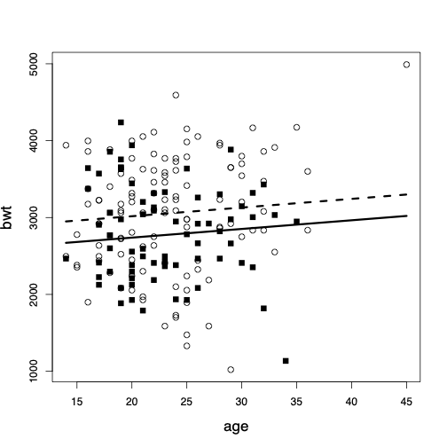
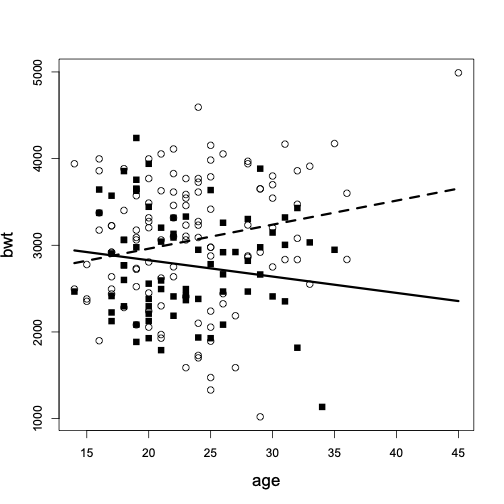

class: title-slide

```{r echo = FALSE}
library(fabricerin)
```

<br>
<br>
.right-panel[ 
<br>

# `r rmarkdown::metadata$title`

### `r rmarkdown::metadata$author`

]


---

### Introduction

- So far, we have focused on linear regression models with only one
explanatory variable. 

- In most cases, however, we are interested in the
relationship between the response variable and multiple explanatory variables. 

- Such models with multiple explanatory variables or predictors are called **multiple linear regression**
models.

- For example, we might want to examine how the birthweight of babies is associated with their mother age and smoking status. 


---

### Multiple Linear Regression

- A multiple linear regression model with $p$ explanatory variables can
be presented as follows:

$$\begin{equation*}
\hat{y}  =  a + b_{1}x_{1} + b_{2}x_{2} + \cdots + b_{p}x_{p}.
\end{equation*}$$

- To fit this model, we can use R as before.


---


### Multiple Linear Regression


```{r message=FALSE, echo=FALSE}
library(tidyverse)
library(ggplot2)
library(MASS)
library(mfp)
data("birthwt")
data("Pima.tr")
Platelet<- read.table("data/Platelet.txt", header=T, sep="")
data(bodyfat, package="mfp")
saltBP <- read.table(file="data/saltBP.txt", header=T, sep="")
```

```{r}
lm(bwt ~ age + factor(smoke), data=birthwt)
```


---

### Interpretation

- The intercept in multiple linear regression model is the expected (average) value of the response variable when all the explanatory variables in the model are set to zero simultaneously. 

- In the above example, the intercept is $a=2791$, which is obtained by setting age and smoking to zero. 

- We might be tempted to interpret this as the average birthweight of babies for nonsmoking mothers ({smoke=0}) with age equal to zero. 

- In this case, however, this is not a reasonable interpretation since mother's age cannot be zero.


---

### Interpretation

- We interpret $b_{j}$ as our estimate of the expected (average) change in the response variable
associated with a unit increase in the corresponding explanatory variable $x_{j}$ **while all other explanatory variables in the model remain fixed**.

- For the above example, the point estimate of the regression coefficient for {age} is $b_{1}=11$, and the estimate of the regression coefficient for {smoke} is $b_{2} = -278$. 

---

### Interpretation

- We expect that the birthweight of babies increase by 11 grams as the mother's age increases by one year among mothers with the same smoking status. 

- The expected birthweight changes by $-278$ (decreases by $278$) grams associated with one unit increase in the value of the variable {smoke} among mothers with the same age.


---

### Additivity

- In multiple linear regression models, we usually assume that the effects of explanatory variables on the response variable are **additive**.

- This means that the expected change in the response variable corresponding to one unit increase in one of the explanatory variables remains the same regardless of the values of other explanatory variables in the model.


---

### Additivity

- Here, nonsmoking mothers are shown as {circles}, while smoking mothers are shown as {squares}. The {dashed line} shows the regression line among nonsmoking mothers, and the {solid line} shows the regression line among the smoking mothers

```{r, echo=FALSE,out.width='25%',out.height='40%',fig.align='center'}

```


---

### Interaction

- We might believe that the effects are not additive.

- That is, the effect of one explanatory variable $x_{1}$ on the response variable depends on the
value of another explanatory variable $x_{2}$ in the model.

- We can still use linear regression models by including a new variable $x_{3} = x_{1}x_{2}$,

$$\begin{eqnarray*}
\hat{y} = a + b_{1}x_{1} + b_{2}x_{2} + b_{12}x_{1}x_{2}
\end{eqnarray*}$$


---


### Interaction

- The term $x_{1}x_{2}$ is called the **interaction term**. 

- We refer to $b_{1}$ and $b_{2}$ as the **main effects**, and refer to $b_{12}$ as the **interaction effect**.


- Note that when we include an interaction term in our model, we should be cautious about how we interpret model parameters. 


- In R, to fit models with interaction terms, we use "*" instead of "+" to separate variables. 

```{r, eval=FALSE}
lm(bwt ~ factor(smoke) * age, data=birthwt)
```


---

### Interaction

- Here, nonsmoking mothers are shown as {circles}, while smoking mothers are shown as {squares}. The {dashed line} shows the regression line among nonsmoking mothers, and the {solid line} shows the regression line among the smoking mothers

```{r, echo=FALSE,out.width='25%',out.height='20%',fig.align='center'}

```
