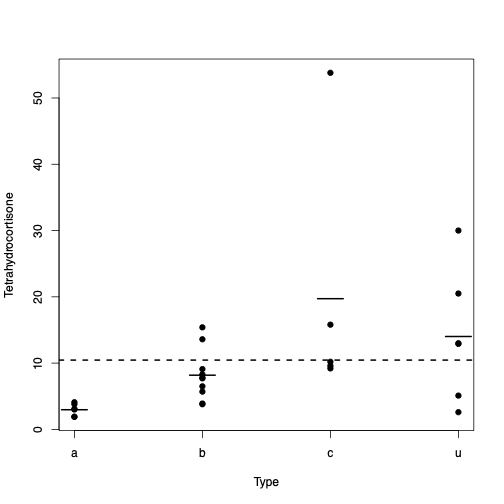
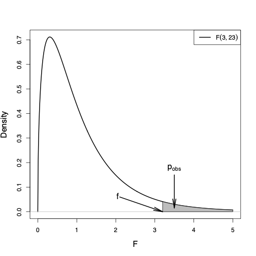
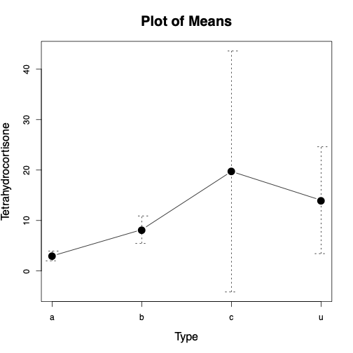
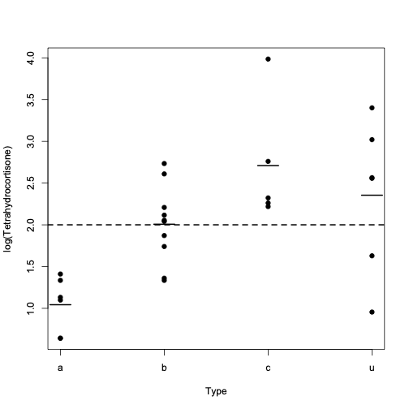

class: title-slide

```{r echo = FALSE}
library(fabricerin)
```

<br>
<br>
.right-panel[ 
<br>

# `r rmarkdown::metadata$title`

### `r rmarkdown::metadata$author`

]

---

### Introduction

We discuss Analysis of Variance (ANOVA) models that    generalize the $t$-test and
are used to compare the means of multiple groups identified by a
categorical variable with more than two possible categories. 

- The categorical variable is called the *factor* and is typically
considered as the explanatory variable. 
- In contrast, the numerical
variable, whose means across different groups are compared, is regarded
as the response variable.

- We mainly focus on ANOVA models with only one factor; These models are known as *one-way* ANOVA.


---

### Example

As an example, we analyze the {Cushings} data set,
which is available from the {MASS} package. 


```{r, echo=FALSE,out.width='30%',out.height='40%',fig.align='center'}

```


---

### Between-groups vs. within-groups variations


- Across the four groups, there appears to be considerable variation in
the group means (i.e., deviations of the small solid lines from the
dashed line), $SS_{B}$.

- Likewise, within groups, there are different degrees of
variation of the observations from their specific mean (i.e., variation
of points around the corresponding small horizontal line), $SS_{W}$. 

- Both sources of variation contribute to the total variation of the
observations around the overall mean (dashed line).

$$\begin{equation*}
\mathit{SS}  =  \mathit{SS}_{B} + \mathit{SS}_{W}.
\end{equation*}$$


---

### Hypothesis testing

- Let us denote the overall population mean of $Y$ as $\mu$ and
group-specific population means as $\mu_{1}, \ldots, \mu_{4}$. 

- We want to evaluate the null hypothesis,
$$\begin{eqnarray*}
H_{0}: \mu_{1} = \mu_{2} = \mu_{3} = \mu_{4} = \mu,
\end{eqnarray*}$$

- For this, we use the following test statistic where $n$ is the total sample size, and $k$ is the number of groups:

$$\begin{equation*}
F  =  \frac{\mathit{SS}_{B}/(k-1)}{\mathit{SS}_{W}/(n-k)}\,,
\end{equation*}$$


---

### Hypothesis testing

- The $F$-statistic has $F(df_1 = k-1, df_2 =n-k)$ distribution under the null hypothesis.

- For the above example, the degrees of freedom parameters are $df_{1} = {4-1 = 3}$ and $df_{2} = 27 - 4 = 23$; the observed value of $F$ is $f=3.2$.

```{r, echo=FALSE,out.width='20%',out.height='40%',fig.align='center'}

```

---

### The assumptions of ANOVA

- To use ANOVA models, we assume that the samples are selected randomly
from the population and independently from each other (e.g., by using
simple random sampling). 

- Further, we assume that the response variable
in each group has a normal distribution. 

- While the means of these
normal distributions can change from one group to another, we assume
that they all have the same variance.


---

### The assumptions of ANOVA

- Violation of these assumption could lead to wrong inference. 

- For the example discussed above, the constant variance assumption does not seem reasonable.

```{r, echo=FALSE,out.width='30%',out.height='40%',fig.align='center'}

```


---

### The assumptions of ANOVA

- Sometimes, we can stabilize the variance (i.e., making it approximately
constant) by using simple data transformations such as log or square
root. 


```{r, echo=FALSE,out.width='30%',out.height='40%',fig.align='center'}

```

---

### The assumptions of ANOVA

- Sometimes, we can stabilize the variance (i.e., making it approximately
constant) by using simple data transformations such as log or square
root. 


```{r, echo=FALSE,out.width='30%',out.height='40%',fig.align='center'}

```

---

```{r}
library(MASS)
data(Pima.tr)

Pima.tr$weight.status <- rep(NA, 200)

for(i in 1:200){
if(Pima.tr$bmi[i] < 18.5 ){
	Pima.tr$weight.status[i]<-'Underweight'
} else if(Pima.tr$bmi[i] >= 18.5 & Pima.tr$bmi[i] <24.9 ) {
	Pima.tr$weight.status[i]<-'Normal'
} else if(Pima.tr$bmi[i] >= 24.9 & Pima.tr$bmi[i] <29.9 ) {
	Pima.tr$weight.status[i]<-'Overweight'
} else {
	Pima.tr$weight.status[i]<-'Obese'
}
}
```

